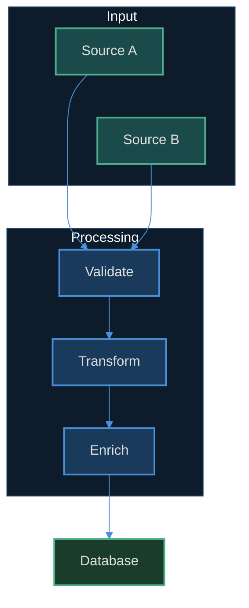

# Marketplace Remediation Implementation Plan

← [Back to Docs](../README.md)

> **For agentic workers:** REQUIRED SUB-SKILL: Use superpowers:subagent-driven-development (recommended) or superpowers:executing-plans to implement this plan task-by-task. Steps use checkbox (`- [ ]`) syntax for tracking.

**Goal:** Turn `kennys-ai-integrations` from an unverified accretion of five plugins into three plugins organised by concern and free of MCP dependencies, with an automated validation gate, an API-backed image generator, and an ebook pipeline that matches the conventions of the `book-library` repo it actually feeds.

**Architecture:** A Python validator in `tools/` becomes the repo's first feedback loop and runs in CI on every push — every bug found during the July 2026 audit is encoded as a validator rule, so it cannot recur. `image-gen` is rebuilt on the Gemini image API via a single `uv`-run script, replacing browser screenshotting entirely; the four near-duplicate browser skills collapse to two API skills, and OpenAI is removed outright. `mermaid-diagrams` is retired and its content absorbed into a new `documentation-conventions` plugin, which also takes `markdown-conventions` off `dev-conventions` so documentation authoring and Python scaffolding stop being bundled together. `notebooklm` and `dev-conventions` are retired in favour of maintained third-party equivalents (`notebooklm-py`, and `uv init` / `scientific-python/cookie`), which also removes the repo's last Playwright dependency. `ebook-processing` is realigned to the real `book-library` layout and unblocked by the image-gen rewrite.

**Tech Stack:** Python 3.11+ (validator, image generator), `uv` for dependency resolution and script running, `pytest` for tests, `ruff` for lint, GitHub Actions for CI, `google-genai` SDK, Calibre CLI, WeasyPrint.

## Global Constraints

- **Python floor:** `>=3.11` for all Python in this repo.
- **Dependency management:** `uv` only. No `pip install` into a global environment. Plugin-shipped scripts use PEP 723 inline metadata so they run with zero setup via `uv run`.
- **No tilde in argv.** Any path passed as a process argument (`.mcp.json` args, script args) must be absolute or expanded at runtime. `~` is a shell feature and is taken literally by `execve`. This is the bug that produced a 131 MB `./~/` directory in the repo root.
- **Every plugin directory must be listed in `.claude-plugin/marketplace.json`, and vice versa.** No orphans in either direction.
- **`plugin.json` `name` must equal its directory name**; `SKILL.md` frontmatter `name` must equal its directory name.
- **Semver, and bump it.** Any change to a plugin's skills bumps that plugin's `version`. The repo has already needed a "force cache refresh" commit because this was skipped.
- **British spelling in user-facing prose** (`colour`, `organised`), matching the existing README and skills. Code identifiers stay US-spelled (`color:` in CSS/Mermaid is a keyword).
- **No browser automation anywhere in this repo.** No Playwright, no MCP browser tools, no `stealth.js`, no scraping a rendered page. Every plugin talks to an API or a local CLI. `grep -rn 'mcp__\|playwright\|browser_' plugins/` must return nothing by the end of the plan.
- **Gemini is the only image provider.** OpenAI image models require Organization Verification (government photo ID plus a live selfie) and are declined; `dall-e-3` is retired. No OpenAI code, model ID, env var, or skill may be introduced.
- **The model ID is configurable via environment**, defaulting to `gemini-2.5-flash-image` via `NANOBANANA_MODEL`. Never hardcode it as the only option.
- **Billing is prepaid with auto-reload off.** Spend cannot exceed the loaded balance; exhaustion surfaces as `429 RESOURCE_EXHAUSTED`. Warn the user of count and approximate cost (~$0.04/image) before any large batch.
- **Validator must exit non-zero on any `error`-level finding**, zero on warnings only. CI depends on this contract.

## Decisions Taken (and why)

These were judgement calls made while planning. Flagging them so they can be overridden cheaply.

1. **`ebook-processing` is NOT renamed.** A rename churns the marketplace key, the docs and every cross-reference for no functional gain. The name is accurate.
2. **`mermaid-diagrams` is removed outright, not deprecated in place.** It is not enabled in any known consumer's settings (including the author's), so there is no migration burden. Its content survives as the `mermaid-conventions` skill inside the new `documentation-conventions` plugin.
2b. **`documentation-conventions` is a new plugin, not a folder inside `dev-conventions`.** Documentation authoring and Python project scaffolding trigger in different situations and are useful independently; bundling them meant loading one to get the other. This needs a one-off `/plugin install` — see Task 10 Step 8.
2d. **`dev-conventions` is retired.** `uv init --lib` already emits more scaffolding than `python-project-setup` did, and [`scientific-python/cookie`](https://github.com/scientific-python/cookie) is the community-standard package template. The skill's one irreplaceable capability — fixing an *existing* project's setup — is knowingly given up. See Task 11.

2c. **`notebooklm` is retired rather than repaired.** Google has no consumer NotebookLM API (the official one is enterprise-only, via Google Cloud), but `notebooklm-py` — MIT, actively maintained — calls the internal `batchexecute` RPC instead of scraping the DOM and ships its own Claude Code skill. Writing our own was never competing with an official option, only with a better unofficial one. See Task 12 for the migration note.

3. **The DeDRM / ACSM path is kept, not deleted.** It processes books the author owns. Task 13 adds an explicit prerequisites-and-legal-position notice and keeps it off the default pipeline path, but does not remove working functionality — that would be scaling down the user's tooling on their behalf.
4. **Browser automation is removed from `image-gen`, not retained as a fallback.** Superseded on 2026-07-29: prepaid Gemini billing was set up and a live call returned a 1024×1024 / 850 KB PNG, so the API is available and the fallback has no remaining audience. `stealth.js` goes with it. Both stay recoverable from git history. With `notebooklm` also retired (decision 2c), no Playwright or MCP dependency remains anywhere in the repo.
5. **`tools/` uses `uv` + `pyproject.toml` rather than the `./venv` layout from the repo's own `python-project-setup` skill.** CI needs a lockfile-driven install; `uv` reads the same `pyproject.toml`, so the skill's conventions still hold for the fields that matter.

## File Structure

```
kennys-ai-integrations/
├── .github/workflows/validate.yml          NEW  CI gate
├── .gitignore                              MOD  ignore browser junk
├── CLAUDE.md                               NEW  repo agent guide
├── README.md                               MOD  rewritten, tree fixed
├── tools/                                  NEW  the repo's own tooling
│   ├── pyproject.toml
│   ├── src/marketplace_validator/
│   │   ├── __init__.py
│   │   ├── models.py                       Finding dataclass
│   │   ├── manifest.py                     plugin.json + marketplace.json rules
│   │   ├── skills.py                       SKILL.md frontmatter rules
│   │   ├── mcp.py                          .mcp.json rules
│   │   └── cli.py                          entry point
│   └── tests/
│       ├── conftest.py
│       ├── test_manifest.py
│       ├── test_skills.py
│       └── test_mcp.py
├── plugins/
│   ├── dev-conventions/                     DELETE (Task 11)
│   ├── documentation-conventions/           NEW PLUGIN
│   │   ├── README.md
│   │   └── skills/
│   │       ├── markdown-conventions/SKILL.md         MOVED from dev-conventions
│   │       └── mermaid-conventions/SKILL.md          NEW (absorbed)
│   ├── image-gen/
│   │   ├── .mcp.json                        DELETE
│   │   ├── scripts/
│   │   │   ├── generate_image.py            NEW  the actual generator
│   │   │   ├── test_generate_image.py       NEW
│   │   │   └── stealth.js                   DELETE with the browser path
│   │   ├── README.md                        NEW  why Gemini-only, why API
│   │   └── skills/
│   │       ├── generate-image/SKILL.md      NEW  replaces 2 skills
│   │       └── infographic/SKILL.md         NEW  replaces 2 skills
│   └── ebook-processing/
│       ├── scripts/convert_book.sh          NEW  deterministic conversion
│       └── skills/…                         MOD  realigned to book-library
└── docs/
    ├── README.md                            MOD
    └── plans/                               MOD  stale designs archived
```

Deleted: `plugins/mermaid-diagrams/`, `plugins/notebooklm/` and `plugins/dev-conventions/` (entire trees), both `.mcp.json` files, `plugins/image-gen/scripts/stealth.js`, the four browser image skills, `./~/`, `.playwright-mcp/`.

---

## Phase 0 — Stop the bleeding

### Task 1: Repo hygiene and the tilde bug

**Files:**
- Modify: `.gitignore`
- Delete: `./~/` (131 MB), `.playwright-mcp/`
- Delete: `plugins/image-gen/.mcp.json`, `plugins/notebooklm/.mcp.json`

**Interfaces:**
- Consumes: nothing.
- Produces: a clean working tree. Later tasks assume `git status` is empty apart from their own changes.

**Context for the implementer:** `plugins/image-gen/.mcp.json` passed `--user-data-dir "~/Library/Caches/..."`. Because `.mcp.json` args go straight to `execve` without a shell, Playwright created a literal directory named `~` in the repo root and filled it with a Chrome profile — cookies, `Login Data`, a profile picture. It is untracked but not ignored, so it shows in every `git status` and is one `git add -A` away from being published. The intended profile directory under `$HOME` was never created, which means these MCP configs have never worked as designed.

The two `.mcp.json` files are deleted rather than fixed. Both declare a Playwright server, but every `allowed-tools` line in the skills names `mcp__plugin_playwright_playwright__*` — the namespace of the separately-installed `playwright@claude-plugins-official` plugin. A bundled server named `playwright` inside `image-gen` would surface as `mcp__plugin_image-gen_playwright__*` and be addressed by nothing. Keeping them would spawn a second, redundant browser. Task 12 declares the real external dependency in prose instead.

- [ ] **Step 1: Confirm the junk is untracked before deleting anything**

```bash
git ls-files | grep -E '^~/|^\.playwright-mcp/' && echo "TRACKED - STOP" || echo "untracked, safe to delete"
```

Expected: `untracked, safe to delete`. If anything prints `TRACKED - STOP`, halt and report — deletion would need a history rewrite instead.

- [ ] **Step 2: Record what is about to be deleted**

```bash
du -sh './~' .playwright-mcp 2>/dev/null
```

Expected: roughly `131M ./~` and a few MB for `.playwright-mcp`. Note these figures for the commit message.

- [ ] **Step 3: Add the ignore rules**

Append to `.gitignore`:

```gitignore
# Playwright MCP browser artefacts
.playwright-mcp/

# Guard: a literal "~" directory means a tilde leaked into argv somewhere.
# Tilde is a shell feature and is NOT expanded in .mcp.json args or exec calls.
# If this ever reappears, find the offending path and make it absolute.
/~/
```

- [ ] **Step 4: Verify the ignore rules match before deleting**

```bash
git check-ignore -v '~' .playwright-mcp
```

Expected: two lines, each naming `.gitignore` and the rule that matched. If either is silent, the pattern is wrong — fix it before continuing.

- [ ] **Step 5: Delete the junk**

```bash
rm -rf './~' .playwright-mcp
git status --porcelain
```

Expected: only `.gitignore` modified (as ` M .gitignore`).

- [ ] **Step 6: Delete the redundant MCP configs**

```bash
git rm plugins/image-gen/.mcp.json plugins/notebooklm/.mcp.json
```

- [ ] **Step 7: Verify no tilde-in-argv remains anywhere**

```bash
grep -rn '"~/' --include='*.json' . ; echo "exit=$?"
```

Expected: no matches, `exit=1`.

- [ ] **Step 8: Commit**

```bash
git add .gitignore
git commit -m "fix: remove 131MB stray browser profile and the tilde-in-argv bug that made it

.mcp.json args go straight to execve, so --user-data-dir \"~/Library/...\"
created a literal ./~/ directory containing a full Chrome profile with
cookies and login data. The intended \$HOME profile was never created,
so these MCP configs never worked.

Both bundled Playwright servers are removed rather than repaired: the
skills address mcp__plugin_playwright_playwright__* (the separately
installed playwright@claude-plugins-official), so a bundled server named
playwright would surface under a namespace nothing references and would
just spawn a second browser.

Co-Authored-By: Claude Opus 5 <noreply@anthropic.com>"
```

---

## Phase 1 — Build the feedback loop

Nothing in this repo has ever been machine-checked. Every rule below encodes a defect found in the July 2026 audit, so the defect cannot silently return. Build the validator before changing plugin content, so the content changes land against a working gate.

### Task 2: Scaffold the validator and validate `plugin.json`

**Files:**
- Create: `tools/pyproject.toml`
- Create: `tools/src/marketplace_validator/__init__.py`
- Create: `tools/src/marketplace_validator/models.py`
- Create: `tools/src/marketplace_validator/manifest.py`
- Create: `tools/tests/conftest.py`
- Test: `tools/tests/test_manifest.py`

**Interfaces:**
- Consumes: nothing.
- Produces:
  - `Finding(level: str, path: str, message: str)` — frozen dataclass; `level` is `"error"` or `"warning"`.
  - `validate_plugin_manifest(manifest_path: Path, repo_root: Path) -> list[Finding]`
  - Tasks 3–6 import both from `marketplace_validator`.

- [ ] **Step 1: Create the project metadata**

`tools/pyproject.toml`:

```toml
[project]
name = "marketplace-validator"
version = "0.1.0"
description = "Structural validation for the kennys-ai-integrations plugin marketplace"
requires-python = ">=3.11"
dependencies = ["pyyaml>=6.0"]

[project.scripts]
validate-marketplace = "marketplace_validator.cli:main"

[dependency-groups]
dev = ["pytest>=8.0", "ruff>=0.6"]

[build-system]
requires = ["hatchling"]
build-backend = "hatchling.build"

[tool.hatch.build.targets.wheel]
packages = ["src/marketplace_validator"]

[tool.pytest.ini_options]
testpaths = ["tests"]

[tool.ruff]
line-length = 100
target-version = "py311"
```

- [ ] **Step 2: Create the empty package marker**

`tools/src/marketplace_validator/__init__.py`:

```python
"""Structural validation for the kennys-ai-integrations plugin marketplace."""

from marketplace_validator.models import Finding

__all__ = ["Finding"]
```

- [ ] **Step 3: Write the failing test**

`tools/tests/conftest.py`:

```python
import json
from pathlib import Path

import pytest


@pytest.fixture
def repo(tmp_path: Path) -> Path:
    """An empty marketplace skeleton that tests fill in as needed."""
    (tmp_path / ".claude-plugin").mkdir()
    (tmp_path / "plugins").mkdir()
    return tmp_path


def write_plugin(repo: Path, name: str, manifest: dict | None = None) -> Path:
    """Create plugins/<name>/.claude-plugin/plugin.json and return the manifest path."""
    plugin_dir = repo / "plugins" / name
    (plugin_dir / ".claude-plugin").mkdir(parents=True)
    if manifest is None:
        manifest = {
            "name": name,
            "version": "1.0.0",
            "description": "A test plugin.",
            "author": {"name": "kennyrnwilson"},
            "repository": "https://github.com/kennyrnwilson/kennys-ai-integrations",
            "license": "MIT",
            "keywords": ["test"],
        }
    manifest_path = plugin_dir / ".claude-plugin" / "plugin.json"
    manifest_path.write_text(json.dumps(manifest))
    return manifest_path
```

`tools/tests/test_manifest.py`:

```python
import json
from pathlib import Path

from marketplace_validator.manifest import validate_plugin_manifest

from conftest import write_plugin


def levels(findings) -> list[str]:
    return [f.level for f in findings]


def messages(findings) -> str:
    return " | ".join(f.message for f in findings)


def test_valid_manifest_produces_no_findings(repo: Path):
    manifest = write_plugin(repo, "good-plugin")
    assert validate_plugin_manifest(manifest, repo) == []


def test_missing_required_field_is_an_error(repo: Path):
    manifest = write_plugin(
        repo, "no-version", {"name": "no-version", "description": "x", "author": {"name": "k"}}
    )
    findings = validate_plugin_manifest(manifest, repo)
    assert "error" in levels(findings)
    assert "version" in messages(findings)


def test_name_must_match_directory_name(repo: Path):
    manifest = write_plugin(
        repo,
        "actual-dir",
        {
            "name": "claimed-name",
            "version": "1.0.0",
            "description": "x",
            "author": {"name": "k"},
            "repository": "r",
            "license": "MIT",
            "keywords": ["k"],
        },
    )
    findings = validate_plugin_manifest(manifest, repo)
    assert "error" in levels(findings)
    assert "claimed-name" in messages(findings)
    assert "actual-dir" in messages(findings)


def test_non_semver_version_is_an_error(repo: Path):
    manifest = write_plugin(
        repo,
        "bad-version",
        {
            "name": "bad-version",
            "version": "1.0",
            "description": "x",
            "author": {"name": "k"},
            "repository": "r",
            "license": "MIT",
            "keywords": ["k"],
        },
    )
    findings = validate_plugin_manifest(manifest, repo)
    assert "error" in levels(findings)
    assert "semver" in messages(findings).lower()


def test_missing_recommended_field_is_only_a_warning(repo: Path):
    # This is exactly the mermaid-diagrams defect: no repository/license/keywords.
    manifest = write_plugin(
        repo,
        "sparse",
        {"name": "sparse", "version": "1.0.0", "description": "x", "author": {"name": "k"}},
    )
    findings = validate_plugin_manifest(manifest, repo)
    assert levels(findings) == ["warning", "warning", "warning"]
    assert "error" not in levels(findings)


def test_malformed_json_is_an_error(repo: Path):
    manifest = write_plugin(repo, "broken")
    manifest.write_text("{ not json")
    findings = validate_plugin_manifest(manifest, repo)
    assert "error" in levels(findings)
```

- [ ] **Step 4: Run the tests to verify they fail**

```bash
cd tools && uv run --extra dev pytest tests/test_manifest.py -v
```

Expected: collection error — `ModuleNotFoundError: No module named 'marketplace_validator.manifest'`.

- [ ] **Step 5: Write `models.py`**

`tools/src/marketplace_validator/models.py`:

```python
from dataclasses import dataclass

ERROR = "error"
WARNING = "warning"


@dataclass(frozen=True)
class Finding:
    """A single validation result. `path` is repo-relative for stable CI output."""

    level: str
    path: str
    message: str

    def __str__(self) -> str:
        return f"{self.level.upper():7} {self.path}: {self.message}"
```

- [ ] **Step 6: Write `manifest.py`**

`tools/src/marketplace_validator/manifest.py`:

```python
import json
import re
from pathlib import Path

from marketplace_validator.models import ERROR, WARNING, Finding

REQUIRED_FIELDS = ("name", "version", "description", "author")
RECOMMENDED_FIELDS = ("repository", "license", "keywords")
SEMVER = re.compile(r"^\d+\.\d+\.\d+(?:[-+][0-9A-Za-z.-]+)?$")


def _rel(path: Path, repo_root: Path) -> str:
    try:
        return str(path.relative_to(repo_root))
    except ValueError:
        return str(path)


def validate_plugin_manifest(manifest_path: Path, repo_root: Path) -> list[Finding]:
    """Validate one plugins/<name>/.claude-plugin/plugin.json."""
    rel = _rel(manifest_path, repo_root)
    try:
        data = json.loads(manifest_path.read_text())
    except json.JSONDecodeError as exc:
        return [Finding(ERROR, rel, f"is not valid JSON: {exc}")]

    findings: list[Finding] = []

    for field in REQUIRED_FIELDS:
        if not data.get(field):
            findings.append(Finding(ERROR, rel, f"missing required field '{field}'"))

    for field in RECOMMENDED_FIELDS:
        if not data.get(field):
            findings.append(Finding(WARNING, rel, f"missing recommended field '{field}'"))

    # plugin_dir is .../plugins/<name>/.claude-plugin/plugin.json -> up two levels
    directory_name = manifest_path.parent.parent.name
    claimed = data.get("name")
    if claimed and claimed != directory_name:
        findings.append(
            Finding(
                ERROR,
                rel,
                f"name '{claimed}' does not match directory name '{directory_name}'",
            )
        )

    version = data.get("version")
    if version and not SEMVER.match(str(version)):
        findings.append(
            Finding(ERROR, rel, f"version '{version}' is not semver (expected MAJOR.MINOR.PATCH)")
        )

    return findings
```

- [ ] **Step 7: Run the tests to verify they pass**

```bash
cd tools && uv run --extra dev pytest tests/test_manifest.py -v
```

Expected: 6 passed.

- [ ] **Step 8: Commit**

```bash
git add tools/
git commit -m "feat(tools): add marketplace validator with plugin.json rules

First automated check this repo has ever had. Encodes the manifest
defects found in the July 2026 audit: missing repository/license/keywords
(mermaid-diagrams) and name/directory mismatches.

Co-Authored-By: Claude Opus 5 <noreply@anthropic.com>"
```

### Task 3: Cross-check `marketplace.json` against the plugins on disk

**Files:**
- Modify: `tools/src/marketplace_validator/manifest.py`
- Test: `tools/tests/test_manifest.py` (append)

**Interfaces:**
- Consumes: `Finding`, `validate_plugin_manifest` from Task 2.
- Produces: `validate_marketplace(repo_root: Path) -> list[Finding]` — walks `plugins/*/`, validates each manifest, and cross-checks both directions against `.claude-plugin/marketplace.json`. Task 6's CLI calls this.

**Context:** Task 10 removes `mermaid-diagrams`. Without this rule, removing the directory but forgetting the marketplace entry (or vice versa) ships a marketplace that points at nothing.

- [ ] **Step 1: Write the failing test**

Append to `tools/tests/test_manifest.py`:

```python
from marketplace_validator.manifest import validate_marketplace


def write_marketplace(repo: Path, plugin_names: list[str]) -> None:
    (repo / ".claude-plugin" / "marketplace.json").write_text(
        json.dumps(
            {
                "name": "kennys-ai-integrations",
                "owner": {"name": "kennyrnwilson"},
                "plugins": [
                    {"name": n, "source": f"./plugins/{n}", "description": "d"}
                    for n in plugin_names
                ],
            }
        )
    )


def test_matched_plugins_produce_no_errors(repo: Path):
    write_plugin(repo, "alpha")
    write_marketplace(repo, ["alpha"])
    findings = validate_marketplace(repo)
    assert [f for f in findings if f.level == "error"] == []


def test_plugin_on_disk_missing_from_marketplace_is_an_error(repo: Path):
    write_plugin(repo, "alpha")
    write_plugin(repo, "orphan")
    write_marketplace(repo, ["alpha"])
    findings = validate_marketplace(repo)
    assert "error" in levels(findings)
    assert "orphan" in messages(findings)


def test_marketplace_entry_with_no_directory_is_an_error(repo: Path):
    write_plugin(repo, "alpha")
    write_marketplace(repo, ["alpha", "ghost"])
    findings = validate_marketplace(repo)
    assert "error" in levels(findings)
    assert "ghost" in messages(findings)


def test_marketplace_source_path_must_resolve(repo: Path):
    write_plugin(repo, "alpha")
    (repo / ".claude-plugin" / "marketplace.json").write_text(
        json.dumps(
            {
                "name": "m",
                "owner": {"name": "k"},
                "plugins": [{"name": "alpha", "source": "./plugins/wrong-path", "description": "d"}],
            }
        )
    )
    findings = validate_marketplace(repo)
    assert "error" in levels(findings)
    assert "wrong-path" in messages(findings)


def test_plugin_manifest_findings_are_included(repo: Path):
    write_plugin(repo, "sparse", {"name": "sparse", "version": "1.0.0",
                                  "description": "x", "author": {"name": "k"}})
    write_marketplace(repo, ["sparse"])
    findings = validate_marketplace(repo)
    assert "warning" in levels(findings)
```

- [ ] **Step 2: Run to verify failure**

```bash
cd tools && uv run --extra dev pytest tests/test_manifest.py -v
```

Expected: 5 failures — `ImportError: cannot import name 'validate_marketplace'`.

- [ ] **Step 3: Implement `validate_marketplace`**

Append to `tools/src/marketplace_validator/manifest.py`:

```python
def validate_marketplace(repo_root: Path) -> list[Finding]:
    """Validate marketplace.json and every plugin manifest, and cross-check them."""
    marketplace_path = repo_root / ".claude-plugin" / "marketplace.json"
    rel = _rel(marketplace_path, repo_root)

    if not marketplace_path.exists():
        return [Finding(ERROR, rel, "marketplace manifest is missing")]

    try:
        catalog = json.loads(marketplace_path.read_text())
    except json.JSONDecodeError as exc:
        return [Finding(ERROR, rel, f"is not valid JSON: {exc}")]

    findings: list[Finding] = []

    plugins_dir = repo_root / "plugins"
    on_disk: set[str] = set()
    if plugins_dir.is_dir():
        for child in sorted(plugins_dir.iterdir()):
            if not child.is_dir() or child.name.startswith("."):
                continue
            on_disk.add(child.name)
            manifest_path = child / ".claude-plugin" / "plugin.json"
            if not manifest_path.exists():
                findings.append(
                    Finding(ERROR, _rel(child, repo_root), "has no .claude-plugin/plugin.json")
                )
                continue
            findings.extend(validate_plugin_manifest(manifest_path, repo_root))

    listed: set[str] = set()
    for entry in catalog.get("plugins", []):
        name = entry.get("name")
        if not name:
            findings.append(Finding(ERROR, rel, "a plugins[] entry has no 'name'"))
            continue
        listed.add(name)

        source = entry.get("source", "")
        if not source:
            findings.append(Finding(ERROR, rel, f"'{name}' has no 'source'"))
        elif not (repo_root / source).is_dir():
            findings.append(
                Finding(ERROR, rel, f"'{name}' source '{source}' does not resolve to a directory")
            )

    for name in sorted(on_disk - listed):
        findings.append(
            Finding(ERROR, rel, f"plugin directory '{name}' exists but is not listed in plugins[]")
        )
    for name in sorted(listed - on_disk):
        findings.append(
            Finding(ERROR, rel, f"plugins[] lists '{name}' but plugins/{name}/ does not exist")
        )

    return findings
```

- [ ] **Step 4: Run to verify pass**

```bash
cd tools && uv run --extra dev pytest tests/test_manifest.py -v
```

Expected: 11 passed.

- [ ] **Step 5: Commit**

```bash
git add tools/
git commit -m "feat(tools): cross-check marketplace.json against plugins on disk

Catches orphans in both directions and unresolvable source paths, so
removing a plugin (Task 10) cannot leave a dangling catalog entry.

Co-Authored-By: Claude Opus 5 <noreply@anthropic.com>"
```

### Task 4: Validate `SKILL.md` frontmatter

**Files:**
- Create: `tools/src/marketplace_validator/skills.py`
- Test: `tools/tests/test_skills.py`

**Interfaces:**
- Consumes: `Finding`, `ERROR`, `WARNING` from Task 2.
- Produces:
  - `parse_frontmatter(text: str) -> dict | None` — returns `None` when there is no `---` block.
  - `validate_skill(skill_path: Path, repo_root: Path) -> list[Finding]`
  - `validate_all_skills(repo_root: Path) -> list[Finding]`
  - Task 6's CLI calls `validate_all_skills`.

**Context:** Skill descriptions are loaded into every session's context to decide relevance, so an unbounded description is a real cost. 1024 characters is the cap. The `name`/directory match rule catches the class of bug where a skill is renamed on disk but not in frontmatter and silently stops triggering.

- [ ] **Step 1: Write the failing test**

`tools/tests/test_skills.py`:

```python
from pathlib import Path

from marketplace_validator.skills import parse_frontmatter, validate_all_skills, validate_skill


def levels(findings) -> list[str]:
    return [f.level for f in findings]


def messages(findings) -> str:
    return " | ".join(f.message for f in findings)


def write_skill(repo: Path, plugin: str, skill: str, frontmatter: str, body: str = "# Body\n") -> Path:
    skill_dir = repo / "plugins" / plugin / "skills" / skill
    skill_dir.mkdir(parents=True)
    path = skill_dir / "SKILL.md"
    path.write_text(f"---\n{frontmatter}---\n\n{body}")
    return path


GOOD = "name: my-skill\ndescription: Does a specific thing. Use when the user asks for it.\n"


def test_parse_frontmatter_returns_mapping():
    assert parse_frontmatter("---\nname: x\n---\nbody") == {"name": "x"}


def test_parse_frontmatter_returns_none_without_a_block():
    assert parse_frontmatter("# Just a heading\n") is None


def test_valid_skill_produces_no_findings(repo: Path):
    path = write_skill(repo, "p", "my-skill", GOOD)
    assert validate_skill(path, repo) == []


def test_missing_frontmatter_is_an_error(repo: Path):
    skill_dir = repo / "plugins" / "p" / "skills" / "bare"
    skill_dir.mkdir(parents=True)
    path = skill_dir / "SKILL.md"
    path.write_text("# No frontmatter here\n")
    findings = validate_skill(path, repo)
    assert "error" in levels(findings)
    assert "frontmatter" in messages(findings)


def test_missing_description_is_an_error(repo: Path):
    path = write_skill(repo, "p", "my-skill", "name: my-skill\n")
    findings = validate_skill(path, repo)
    assert "error" in levels(findings)
    assert "description" in messages(findings)


def test_name_must_match_directory(repo: Path):
    path = write_skill(repo, "p", "on-disk", "name: in-frontmatter\ndescription: d\n")
    findings = validate_skill(path, repo)
    assert "error" in levels(findings)
    assert "on-disk" in messages(findings)
    assert "in-frontmatter" in messages(findings)


def test_overlong_description_is_a_warning(repo: Path):
    path = write_skill(repo, "p", "my-skill", f"name: my-skill\ndescription: {'x' * 1100}\n")
    findings = validate_skill(path, repo)
    assert levels(findings) == ["warning"]
    assert "1024" in messages(findings)


def test_malformed_yaml_is_an_error(repo: Path):
    path = write_skill(repo, "p", "my-skill", "name: [unclosed\n")
    findings = validate_skill(path, repo)
    assert "error" in levels(findings)


def test_validate_all_skills_walks_every_plugin(repo: Path):
    write_skill(repo, "alpha", "one", "name: one\ndescription: d\n")
    write_skill(repo, "beta", "two", "name: WRONG\ndescription: d\n")
    findings = validate_all_skills(repo)
    assert "error" in levels(findings)
    assert "two" in messages(findings)
```

- [ ] **Step 2: Run to verify failure**

```bash
cd tools && uv run --extra dev pytest tests/test_skills.py -v
```

Expected: collection error — `No module named 'marketplace_validator.skills'`.

- [ ] **Step 3: Implement `skills.py`**

`tools/src/marketplace_validator/skills.py`:

```python
from pathlib import Path

import yaml

from marketplace_validator.models import ERROR, WARNING, Finding

MAX_DESCRIPTION_CHARS = 1024


def _rel(path: Path, repo_root: Path) -> str:
    try:
        return str(path.relative_to(repo_root))
    except ValueError:
        return str(path)


def parse_frontmatter(text: str) -> dict | None:
    """Return the YAML frontmatter mapping, or None if the file has no --- block.

    Raises yaml.YAMLError if the block is present but malformed.
    """
    if not text.startswith("---"):
        return None
    parts = text.split("---", 2)
    if len(parts) < 3:
        return None
    loaded = yaml.safe_load(parts[1])
    return loaded if isinstance(loaded, dict) else {}


def validate_skill(skill_path: Path, repo_root: Path) -> list[Finding]:
    """Validate one plugins/<plugin>/skills/<skill>/SKILL.md."""
    rel = _rel(skill_path, repo_root)

    try:
        frontmatter = parse_frontmatter(skill_path.read_text())
    except yaml.YAMLError as exc:
        return [Finding(ERROR, rel, f"frontmatter is not valid YAML: {exc}")]

    if frontmatter is None:
        return [Finding(ERROR, rel, "has no YAML frontmatter block")]

    findings: list[Finding] = []

    directory_name = skill_path.parent.name
    name = frontmatter.get("name")
    if not name:
        findings.append(Finding(ERROR, rel, "frontmatter is missing required field 'name'"))
    elif name != directory_name:
        findings.append(
            Finding(
                ERROR,
                rel,
                f"frontmatter name '{name}' does not match directory name '{directory_name}'",
            )
        )

    description = frontmatter.get("description")
    if not description:
        findings.append(Finding(ERROR, rel, "frontmatter is missing required field 'description'"))
    elif len(description) > MAX_DESCRIPTION_CHARS:
        findings.append(
            Finding(
                WARNING,
                rel,
                f"description is {len(description)} chars; keep it under "
                f"{MAX_DESCRIPTION_CHARS} — it is loaded into every session's context",
            )
        )

    return findings


def validate_all_skills(repo_root: Path) -> list[Finding]:
    """Validate every SKILL.md under plugins/*/skills/*/."""
    findings: list[Finding] = []
    for skill_path in sorted(repo_root.glob("plugins/*/skills/*/SKILL.md")):
        findings.extend(validate_skill(skill_path, repo_root))
    return findings
```

- [ ] **Step 4: Run to verify pass**

```bash
cd tools && uv run --extra dev pytest tests/test_skills.py -v
```

Expected: 9 passed.

- [ ] **Step 5: Commit**

```bash
git add tools/
git commit -m "feat(tools): validate SKILL.md frontmatter

Requires name and description, enforces name/directory agreement, and
warns on descriptions over 1024 chars since they load into every session.

Co-Authored-By: Claude Opus 5 <noreply@anthropic.com>"
```

### Task 5: Validate MCP configs and undeclared plugin dependencies

**Files:**
- Create: `tools/src/marketplace_validator/mcp.py`
- Test: `tools/tests/test_mcp.py`

**Interfaces:**
- Consumes: `Finding`, `ERROR`, `WARNING`, and `parse_frontmatter` from Task 4.
- Produces:
  - `validate_mcp_configs(repo_root: Path) -> list[Finding]` — tilde-in-argv detection.
  - `validate_tool_dependencies(repo_root: Path) -> list[Finding]` — flags `allowed-tools` entries naming a plugin this marketplace does not define.
  - Task 6's CLI calls both.

**Context:** These are the two highest-value rules in the validator because they encode the two defects that silently broke `image-gen` for months. Rule one catches a tilde anywhere in an `args` array. Rule two catches a skill declaring `mcp__plugin_playwright_playwright__*` when `playwright` is not a plugin this marketplace ships — an undeclared external dependency. That is legitimate (Task 12 documents it), so it is a **warning**, not an error; the point is that it must be visible and deliberate rather than accidental.

- [ ] **Step 1: Write the failing test**

`tools/tests/test_mcp.py`:

```python
import json
from pathlib import Path

from marketplace_validator.mcp import validate_mcp_configs, validate_tool_dependencies


def levels(findings) -> list[str]:
    return [f.level for f in findings]


def messages(findings) -> str:
    return " | ".join(f.message for f in findings)


def write_mcp(repo: Path, plugin: str, config: dict) -> Path:
    plugin_dir = repo / "plugins" / plugin
    plugin_dir.mkdir(parents=True, exist_ok=True)
    path = plugin_dir / ".mcp.json"
    path.write_text(json.dumps(config))
    return path


def write_skill(repo: Path, plugin: str, skill: str, frontmatter: str) -> Path:
    skill_dir = repo / "plugins" / plugin / "skills" / skill
    skill_dir.mkdir(parents=True)
    path = skill_dir / "SKILL.md"
    path.write_text(f"---\n{frontmatter}---\n\n# Body\n")
    return path


def test_absolute_paths_produce_no_findings(repo: Path):
    write_mcp(repo, "p", {"mcpServers": {"s": {"command": "npx",
                                               "args": ["pkg", "--dir", "/tmp/profile"]}}})
    assert validate_mcp_configs(repo) == []


def test_tilde_in_args_is_an_error(repo: Path):
    # The exact image-gen defect that created a 131MB ./~/ directory.
    write_mcp(
        repo,
        "image-gen",
        {"mcpServers": {"playwright": {"command": "npx",
                                       "args": ["@playwright/mcp@latest", "--user-data-dir",
                                                "~/Library/Caches/ms-playwright/profile"]}}},
    )
    findings = validate_mcp_configs(repo)
    assert "error" in levels(findings)
    assert "tilde" in messages(findings).lower()
    assert "--user-data-dir" in messages(findings) or "~/Library" in messages(findings)


def test_tilde_inside_a_nested_env_value_is_also_caught(repo: Path):
    write_mcp(repo, "p", {"mcpServers": {"s": {"command": "x", "args": [],
                                               "env": {"PROFILE": "~/somewhere"}}}})
    findings = validate_mcp_configs(repo)
    assert "error" in levels(findings)


def test_known_plugin_dependency_produces_no_findings(repo: Path):
    (repo / "plugins" / "playwright").mkdir(parents=True)
    write_skill(repo, "image-gen", "gen",
                "name: gen\ndescription: d\n"
                "allowed-tools: Read, mcp__plugin_playwright_playwright__browser_click\n")
    assert validate_tool_dependencies(repo) == []


def test_unknown_plugin_dependency_is_a_warning(repo: Path):
    write_skill(repo, "image-gen", "gen",
                "name: gen\ndescription: d\n"
                "allowed-tools: Read, mcp__plugin_playwright_playwright__browser_click\n")
    findings = validate_tool_dependencies(repo)
    assert levels(findings) == ["warning"]
    assert "playwright" in messages(findings)


def test_allowed_tools_accepts_a_yaml_list(repo: Path):
    write_skill(repo, "image-gen", "gen",
                "name: gen\ndescription: d\n"
                "allowed-tools:\n"
                "  - Read\n"
                "  - mcp__plugin_ghost_server__do_thing\n")
    findings = validate_tool_dependencies(repo)
    assert levels(findings) == ["warning"]
    assert "ghost" in messages(findings)


def test_builtin_tools_are_ignored(repo: Path):
    write_skill(repo, "p", "s", "name: s\ndescription: d\nallowed-tools: Read, Write, Bash, Glob\n")
    assert validate_tool_dependencies(repo) == []
```

- [ ] **Step 2: Run to verify failure**

```bash
cd tools && uv run --extra dev pytest tests/test_mcp.py -v
```

Expected: collection error — `No module named 'marketplace_validator.mcp'`.

- [ ] **Step 3: Implement `mcp.py`**

`tools/src/marketplace_validator/mcp.py`:

```python
import json
import re
from pathlib import Path
from typing import Any

import yaml

from marketplace_validator.models import ERROR, WARNING, Finding
from marketplace_validator.skills import parse_frontmatter

# mcp__plugin_<pluginName>_<serverName>__<toolName>
PLUGIN_TOOL = re.compile(r"^mcp__plugin_([A-Za-z0-9-]+)_[A-Za-z0-9-]+__")


def _rel(path: Path, repo_root: Path) -> str:
    try:
        return str(path.relative_to(repo_root))
    except ValueError:
        return str(path)


def _walk_strings(node: Any, trail: str = "") -> list[tuple[str, str]]:
    """Yield (json-ish path, value) for every string leaf in a nested structure."""
    found: list[tuple[str, str]] = []
    if isinstance(node, str):
        found.append((trail, node))
    elif isinstance(node, dict):
        for key, value in node.items():
            found.extend(_walk_strings(value, f"{trail}.{key}" if trail else str(key)))
    elif isinstance(node, list):
        for index, value in enumerate(node):
            found.extend(_walk_strings(value, f"{trail}[{index}]"))
    return found


def validate_mcp_configs(repo_root: Path) -> list[Finding]:
    """Reject tilde-prefixed paths anywhere in a .mcp.json.

    MCP server args go straight to execve. A tilde is a shell feature and is
    NOT expanded, so "~/Library/..." creates a literal directory named "~"
    in the working directory. This is exactly how a 131 MB Chrome profile
    ended up in the repo root.
    """
    findings: list[Finding] = []
    for config_path in sorted(repo_root.glob("plugins/*/.mcp.json")):
        rel = _rel(config_path, repo_root)
        try:
            config = json.loads(config_path.read_text())
        except json.JSONDecodeError as exc:
            findings.append(Finding(ERROR, rel, f"is not valid JSON: {exc}"))
            continue

        for trail, value in _walk_strings(config):
            if value.startswith("~"):
                findings.append(
                    Finding(
                        ERROR,
                        rel,
                        f"{trail} = '{value}' starts with a tilde. Tilde is a shell "
                        f"feature and is not expanded in process arguments — use an "
                        f"absolute path or expand it at runtime.",
                    )
                )
    return findings


def _declared_plugins(repo_root: Path) -> set[str]:
    plugins_dir = repo_root / "plugins"
    if not plugins_dir.is_dir():
        return set()
    return {c.name for c in plugins_dir.iterdir() if c.is_dir() and not c.name.startswith(".")}


def _allowed_tools(frontmatter: dict) -> list[str]:
    raw = frontmatter.get("allowed-tools")
    if raw is None:
        return []
    if isinstance(raw, str):
        return [item.strip() for item in raw.split(",") if item.strip()]
    if isinstance(raw, list):
        return [str(item).strip() for item in raw]
    return []


def validate_tool_dependencies(repo_root: Path) -> list[Finding]:
    """Warn when a skill's allowed-tools names a plugin this marketplace does not ship.

    Depending on an externally-installed plugin is legitimate, but it must be a
    deliberate, documented choice rather than an accident.
    """
    declared = _declared_plugins(repo_root)
    findings: list[Finding] = []

    for skill_path in sorted(repo_root.glob("plugins/*/skills/*/SKILL.md")):
        rel = _rel(skill_path, repo_root)
        try:
            frontmatter = parse_frontmatter(skill_path.read_text())
        except yaml.YAMLError:
            continue  # already reported by validate_skill
        if not frontmatter:
            continue

        seen: set[str] = set()
        for tool in _allowed_tools(frontmatter):
            match = PLUGIN_TOOL.match(tool)
            if not match:
                continue
            plugin_name = match.group(1)
            if plugin_name in declared or plugin_name in seen:
                continue
            seen.add(plugin_name)
            findings.append(
                Finding(
                    WARNING,
                    rel,
                    f"allowed-tools references plugin '{plugin_name}', which this "
                    f"marketplace does not ship. Document it as an external "
                    f"dependency in the plugin README.",
                )
            )
    return findings
```

- [ ] **Step 4: Run to verify pass**

```bash
cd tools && uv run --extra dev pytest tests/test_mcp.py -v
```

Expected: 7 passed.

- [ ] **Step 5: Commit**

```bash
git add tools/
git commit -m "feat(tools): detect tilde-in-argv and undeclared plugin dependencies

Rule one encodes the defect that created a 131MB ./~/ directory. Rule two
surfaces skills that address an externally-installed plugin's MCP
namespace, which is legitimate but must be deliberate.

Co-Authored-By: Claude Opus 5 <noreply@anthropic.com>"
```

### Task 6: Wire the validator into a CLI and CI, then fix everything it reports

**Files:**
- Create: `tools/src/marketplace_validator/cli.py`
- Create: `.github/workflows/validate.yml`
- Modify: `plugins/mermaid-diagrams/.claude-plugin/plugin.json` (and any other file the validator flags)

**Interfaces:**
- Consumes: `validate_marketplace`, `validate_all_skills`, `validate_mcp_configs`, `validate_tool_dependencies`.
- Produces: `main(argv: list[str] | None = None) -> int` — exit `1` on any error-level finding, `0` otherwise. CI depends on this contract.

- [ ] **Step 1: Write the CLI**

`tools/src/marketplace_validator/cli.py`:

```python
import argparse
import sys
from pathlib import Path

from marketplace_validator.manifest import validate_marketplace
from marketplace_validator.mcp import validate_mcp_configs, validate_tool_dependencies
from marketplace_validator.models import ERROR
from marketplace_validator.skills import validate_all_skills


def main(argv: list[str] | None = None) -> int:
    parser = argparse.ArgumentParser(description="Validate the plugin marketplace structure.")
    parser.add_argument(
        "repo_root",
        nargs="?",
        default=".",
        type=Path,
        help="Path to the marketplace repository root (default: current directory)",
    )
    parser.add_argument(
        "--strict",
        action="store_true",
        help="Treat warnings as errors",
    )
    args = parser.parse_args(argv)
    root = args.repo_root.resolve()

    findings = [
        *validate_marketplace(root),
        *validate_all_skills(root),
        *validate_mcp_configs(root),
        *validate_tool_dependencies(root),
    ]

    errors = [f for f in findings if f.level == ERROR]
    warnings = [f for f in findings if f.level != ERROR]

    for finding in errors + warnings:
        print(finding, file=sys.stderr if finding.level == ERROR else sys.stdout)

    print(f"\n{len(errors)} error(s), {len(warnings)} warning(s)")

    if errors:
        return 1
    if warnings and args.strict:
        return 1
    return 0


if __name__ == "__main__":
    raise SystemExit(main())
```

- [ ] **Step 2: Run the validator against the real repo**

```bash
cd tools && uv run validate-marketplace ..
```

Expected: a non-zero exit with real findings. At minimum: three warnings for `mermaid-diagrams` (missing `repository`, `license`, `keywords`), and warnings for every `image-gen` skill referencing the external `playwright` plugin. Record the full output — the next step fixes it.

- [ ] **Step 3: Fix every error-level finding**

Work through the errors reported in Step 2. The expected fix at this point is `plugins/mermaid-diagrams/.claude-plugin/plugin.json`, which needs the three recommended fields added:

```json
{
  "name": "mermaid-diagrams",
  "version": "1.0.0",
  "description": "Professional dark-mode Mermaid diagram generator for VS Code and local editors",
  "author": {
    "name": "kennyrnwilson"
  },
  "repository": "https://github.com/kennyrnwilson/kennys-ai-integrations",
  "license": "MIT",
  "keywords": ["mermaid", "diagrams", "flowchart", "dark-mode", "documentation"]
}
```

(This plugin is removed in Task 10. Fixing it now keeps the tree green between here and there, so CI is trustworthy for the intervening tasks.)

The `playwright` dependency warnings are expected and are resolved by documentation in Tasks 10 and 13, not by code. Do not suppress them.

- [ ] **Step 4: Re-run and confirm zero errors**

```bash
cd tools && uv run validate-marketplace .. ; echo "exit=$?"
```

Expected: `0 error(s)`, some warnings, `exit=0`.

- [ ] **Step 5: Add the CI workflow**

`.github/workflows/validate.yml`:

```yaml
name: validate

on:
  push:
    branches: [main]
  pull_request:

jobs:
  validate:
    runs-on: ubuntu-latest
    steps:
      - uses: actions/checkout@v4

      - name: Install uv
        uses: astral-sh/setup-uv@v5
        with:
          enable-cache: true

      - name: Run validator unit tests
        working-directory: tools
        run: uv run --extra dev pytest -v

      - name: Lint
        working-directory: tools
        run: uv run --extra dev ruff check .

      - name: Validate marketplace structure
        working-directory: tools
        run: uv run validate-marketplace ..
```

- [ ] **Step 6: Verify the full CI sequence locally**

```bash
cd tools && uv run --extra dev pytest -v && uv run --extra dev ruff check . && uv run validate-marketplace ..
echo "exit=$?"
```

Expected: 27 tests pass, ruff clean, validator reports 0 errors, `exit=0`.

- [ ] **Step 7: Commit**

```bash
git add tools/ .github/ plugins/mermaid-diagrams/.claude-plugin/plugin.json
git commit -m "feat(ci): gate every push on marketplace validation

Adds the CLI entry point and a GitHub Actions workflow running the
validator's own tests, ruff, and the structural check. Fills in the
mermaid-diagrams manifest fields the validator flagged.

The repo now has a feedback loop for the first time.

Co-Authored-By: Claude Opus 5 <noreply@anthropic.com>"
```

---

## Phase 2 — Rebuild `image-gen` on the Gemini API

**Verified on 2026-07-29 against the prepaid key.** A live call to `gemini-2.5-flash-image` returned HTTP 200 with a **1024×1024, 850 KB PNG**. The API route is confirmed working, so this phase replaces browser automation outright rather than keeping it as a fallback.

**Why the browser path goes away entirely:**

| | Browser capture (current) | Gemini API (verified) |
|---|---|---|
| Output | 1024×**559** crop of a rendered element | 1024×**1024** native asset |
| Median size in `book-library` | ~176 KB | ~830 KB |
| Failure rate | ~14% (34 `.debug.png` + 64 `.error.png` against 581 successes) | Structured `finishReason` on every response |
| Pacing | 45s between images, 4 per session | None |
| Terms of service | Outside both providers' terms | Supported use |

**OpenAI is removed completely.** Its image models require Organization Verification — government photo ID plus a live selfie — which has been declined. No OpenAI code, model ID, environment variable, or skill survives this phase. `dall-e-3` is also retired by OpenAI (*"The model 'dall-e-3' does not exist"*), so there is no unverified fallback there either.

**Consequences to be aware of while implementing:**

1. `book-infographics` currently produces two images per book (ChatGPT + Gemini). It will now produce one. Existing `*_infographic_chatgpt.png` files in `book-library` are left untouched — this plan does not rename or delete library content.
2. `stealth.js`, the Playwright browser skills, and all rate-limit choreography are deleted. They remain recoverable from git history if ever needed.
3. Every image now costs roughly $0.04 against a prepaid balance with auto-reload off, so spend is bounded by the loaded credit and cannot exceed it.

### Task 7: Gemini image generator — prompt building and generation

**Files:**
- Create: `plugins/image-gen/scripts/generate_image.py`
- Test: `plugins/image-gen/scripts/test_generate_image.py`

**Interfaces:**
- Consumes: nothing.
- Produces:
  - `class ImageGenerationError(RuntimeError)`
  - `build_prompt(text: str, *, kind: str = "image", style: str = "modern") -> str` — `kind` is `"image"` or `"infographic"`.
  - `generate(prompt: str, output: Path, *, aspect_ratio: str = "16:9", model: str | None = None, client=None) -> Path`
  - Task 8 adds the CLI on top of these.

**Context for the implementer:** the script uses PEP 723 inline dependency metadata so `uv run` resolves dependencies with zero setup on any machine. The `client` parameter exists purely for dependency injection in tests; production callers leave it `None` and the function constructs a real client from `GEMINI_API_KEY`.

There is exactly one provider. Do not add a `provider` parameter, an OpenAI branch, or any abstraction anticipating a second backend — YAGNI, and the second backend has been explicitly ruled out.

The API signals "I produced text instead of an image" through `FinishReason.NO_IMAGE`, and refusals through `IMAGE_SAFETY` / `IMAGE_PROHIBITED_CONTENT`. These replace the browser path's unreliable "did prose appear?" heuristic.

Valid aspect ratios, verified against the live API: `1:1`, `1:4`, `1:8`, `2:3`, `3:2`, `3:4`, `4:1`, `4:3`, `4:5`, `5:4`, `8:1`, `9:16`, `16:9`, `21:9`.

- [ ] **Step 1: Write the failing test**

`plugins/image-gen/scripts/test_generate_image.py`:

```python
"""Tests for generate_image.py.

Run with:  uv run --with pytest pytest plugins/image-gen/scripts/test_generate_image.py -v
"""

import sys
from pathlib import Path

import pytest

sys.path.insert(0, str(Path(__file__).parent))

from generate_image import (  # noqa: E402
    VALID_ASPECT_RATIOS,
    ImageGenerationError,
    build_prompt,
    generate,
)

PNG_BYTES = b"\x89PNG\r\n\x1a\n" + b"fake image data"


class FakePart:
    def __init__(self, data: bytes | None):
        self.inline_data = type("Blob", (), {"data": data})() if data else None


class FakeResponse:
    def __init__(self, parts=None, finish_reason=None):
        self.parts = parts or []
        candidate = type("Candidate", (), {"finish_reason": finish_reason})()
        self.candidates = [candidate]


class FakeModels:
    def __init__(self, response):
        self._response = response
        self.calls = []

    def generate_content(self, **kwargs):
        self.calls.append(kwargs)
        return self._response


class FakeClient:
    def __init__(self, response):
        self.models = FakeModels(response)


def test_build_prompt_passes_plain_text_through_for_images():
    assert build_prompt("a dancing dog in a park", kind="image") == "a dancing dog in a park"


def test_build_prompt_adds_infographic_styling():
    result = build_prompt("benefits of remote work", kind="infographic", style="minimal")
    assert "benefits of remote work" in result
    assert "infographic" in result.lower()
    assert "minimal" in result
    assert "dark navy" in result.lower()


def test_build_prompt_forbids_depicting_real_people_in_infographics():
    result = build_prompt("history of aviation", kind="infographic")
    assert "real people" in result.lower() or "public figures" in result.lower()


def test_build_prompt_rejects_an_unknown_kind():
    with pytest.raises(ValueError, match="kind"):
        build_prompt("x", kind="nonsense")


def test_build_prompt_rejects_an_unknown_style():
    with pytest.raises(ValueError, match="style"):
        build_prompt("x", kind="infographic", style="neon-brutalist")


def test_generate_writes_the_returned_bytes(tmp_path: Path):
    client = FakeClient(FakeResponse(parts=[FakePart(PNG_BYTES)]))
    out = tmp_path / "result.png"

    assert generate("a prompt", out, client=client) == out
    assert out.read_bytes() == PNG_BYTES


def test_generate_passes_model_and_aspect_ratio(tmp_path: Path):
    client = FakeClient(FakeResponse(parts=[FakePart(PNG_BYTES)]))
    generate("p", tmp_path / "o.png", aspect_ratio="9:16",
             model="gemini-2.5-flash-image", client=client)

    call = client.models.calls[0]
    assert call["model"] == "gemini-2.5-flash-image"
    assert call["config"].image_config.aspect_ratio == "9:16"


def test_generate_rejects_an_invalid_aspect_ratio(tmp_path: Path):
    client = FakeClient(FakeResponse(parts=[FakePart(PNG_BYTES)]))
    with pytest.raises(ValueError, match="aspect_ratio"):
        generate("p", tmp_path / "o.png", aspect_ratio="99:1", client=client)


def test_every_documented_aspect_ratio_is_accepted(tmp_path: Path):
    for ratio in VALID_ASPECT_RATIOS:
        client = FakeClient(FakeResponse(parts=[FakePart(PNG_BYTES)]))
        generate("p", tmp_path / f"{ratio.replace(':', '-')}.png",
                 aspect_ratio=ratio, client=client)


def test_generate_raises_when_the_model_answered_in_text(tmp_path: Path):
    client = FakeClient(FakeResponse(parts=[FakePart(None)], finish_reason="NO_IMAGE"))
    with pytest.raises(ImageGenerationError, match="NO_IMAGE"):
        generate("p", tmp_path / "o.png", client=client)


def test_generate_raises_on_a_safety_block(tmp_path: Path):
    client = FakeClient(FakeResponse(parts=[], finish_reason="IMAGE_SAFETY"))
    with pytest.raises(ImageGenerationError, match="IMAGE_SAFETY"):
        generate("p", tmp_path / "o.png", client=client)


def test_generate_writes_no_file_when_it_fails(tmp_path: Path):
    client = FakeClient(FakeResponse(parts=[], finish_reason="NO_IMAGE"))
    out = tmp_path / "should-not-exist.png"
    with pytest.raises(ImageGenerationError):
        generate("p", out, client=client)
    assert not out.exists()


def test_generate_creates_missing_parent_directories(tmp_path: Path):
    client = FakeClient(FakeResponse(parts=[FakePart(PNG_BYTES)]))
    out = tmp_path / "nested" / "deeper" / "result.png"
    generate("p", out, client=client)
    assert out.exists()
```

- [ ] **Step 2: Run to verify failure**

```bash
uv run --with pytest pytest plugins/image-gen/scripts/test_generate_image.py -v
```

Expected: collection error — `ModuleNotFoundError: No module named 'generate_image'`.

- [ ] **Step 3: Implement the generator**

`plugins/image-gen/scripts/generate_image.py`:

```python
#!/usr/bin/env -S uv run --script
# /// script
# requires-python = ">=3.11"
# dependencies = ["google-genai>=1.33"]
# ///
"""Generate images via the Gemini image API.

Replaces the previous browser-automation approach, which captured a screenshot
of a rendered  element -- yielding 1024x559 crops of roughly 176 KB where
the API returns 1024x1024 native assets of roughly 830 KB, and failing about
14% of the time.

Requires GEMINI_API_KEY. Billing is prepaid with auto-reload off, so spend
cannot exceed the loaded balance.
"""

import os
from pathlib import Path

DEFAULT_MODEL = os.environ.get("NANOBANANA_MODEL", "gemini-2.5-flash-image")

VALID_KINDS = ("image", "infographic")
VALID_STYLES = ("modern", "minimal", "abstract", "illustrated", "tech")

# Verified against the live API error message on 2026-07-29.
VALID_ASPECT_RATIOS = (
    "1:1", "1:4", "1:8", "2:3", "3:2", "3:4", "4:1",
    "4:3", "4:5", "5:4", "8:1", "9:16", "16:9", "21:9",
)

INFOGRAPHIC_TEMPLATE = """\
Create a single infographic image about the following.

Style: {style}, professional, clean.
Background: dark navy/blue.
Colours: bright and vibrant, chosen to read well on a dark background.
Layout: clear sections with icons, strong typographic hierarchy.
Constraint: do not depict any specific real people or public figures. Use \
abstract icons, symbols and conceptual imagery to represent all ideas and people.

Content:
{text}
"""


class ImageGenerationError(RuntimeError):
    """The model did not return an image."""


def build_prompt(text: str, *, kind: str = "image", style: str = "modern") -> str:
    """Build the model prompt.

    For kind="image" the caller's text is the prompt, passed through unchanged.
    For kind="infographic" it is wrapped in the house style.
    """
    if kind not in VALID_KINDS:
        raise ValueError(f"kind must be one of {VALID_KINDS}, got {kind!r}")
    if kind == "image":
        return text
    if style not in VALID_STYLES:
        raise ValueError(f"style must be one of {VALID_STYLES}, got {style!r}")
    return INFOGRAPHIC_TEMPLATE.format(style=style, text=text)


def _finish_reason(response) -> str | None:
    candidates = getattr(response, "candidates", None) or []
    if not candidates:
        return None
    reason = getattr(candidates[0], "finish_reason", None)
    return str(reason) if reason is not None else None


def generate(
    prompt: str,
    output: Path,
    *,
    aspect_ratio: str = "16:9",
    model: str | None = None,
    client=None,
) -> Path:
    """Generate one image and write it to `output`.

    Writes nothing on failure -- a missing file is a correct failure, whereas
    the browser path's habit of saving whatever was on screen silently
    corrupted the library with screenshots of prose.
    """
    from google.genai import types

    if aspect_ratio not in VALID_ASPECT_RATIOS:
        raise ValueError(
            f"aspect_ratio must be one of {VALID_ASPECT_RATIOS}, got {aspect_ratio!r}"
        )

    if client is None:
        from google import genai

        client = genai.Client()

    model = model or DEFAULT_MODEL

    response = client.models.generate_content(
        model=model,
        contents=prompt,
        config=types.GenerateContentConfig(
            response_modalities=["IMAGE"],
            image_config=types.ImageConfig(aspect_ratio=aspect_ratio),
        ),
    )

    for part in getattr(response, "parts", None) or []:
        blob = getattr(part, "inline_data", None)
        data = getattr(blob, "data", None) if blob else None
        if data:
            output.parent.mkdir(parents=True, exist_ok=True)
            output.write_bytes(data)
            return output

    reason = _finish_reason(response) or "no image part in response"
    raise ImageGenerationError(
        f"Gemini returned no image (finish_reason={reason}). "
        f"NO_IMAGE means the model answered in text -- reword the prompt to be "
        f"more concretely visual. IMAGE_SAFETY and IMAGE_PROHIBITED_CONTENT "
        f"mean the request was blocked; do not attempt to reword around a "
        f"safety block."
    )
```

- [ ] **Step 4: Run to verify pass**

```bash
uv run --with pytest pytest plugins/image-gen/scripts/test_generate_image.py -v
```

Expected: 13 passed.

- [ ] **Step 5: Smoke-test against the live API**

```bash
# The session shell may hold a stale key: ~/.zshrc.secrets is only sourced by
# interactive shells. Load it explicitly. See docs/plans/2026-07-29-execution-handoff.md
export GEMINI_API_KEY="$(zsh -c 'source ~/.zshrc.secrets 2>/dev/null; printf "%s" "$GEMINI_API_KEY"')"

uv run --with pytest python -c "
import sys; sys.path.insert(0, 'plugins/image-gen/scripts')
from pathlib import Path
from generate_image import build_prompt, generate
out = generate(build_prompt('a teal circle on a dark navy background', kind='image'),
               Path('/tmp/smoke.png'), aspect_ratio='1:1')
print('wrote', out, out.stat().st_size, 'bytes')
"
sips -g pixelWidth -g pixelHeight /tmp/smoke.png
```

Expected: a real PNG well over 100 KB at 1024×1024. This costs about $0.04 against the prepaid balance.

- [ ] **Step 6: Commit**

```bash
git add plugins/image-gen/scripts/
git commit -m "feat(image-gen): add Gemini API image generator

Replaces browser screenshotting with a real API call returning native 1024px
assets. Verified: HTTP 200, 1024x1024, 850KB -- against the browser path's
1024x559 crops averaging 176KB with a ~14% failure rate.

Gemini only. OpenAI image models require government photo ID plus a live
selfie for Organization Verification, which is declined, and dall-e-3 has
been retired.

Co-Authored-By: Claude Opus 5 <noreply@anthropic.com>"
```

### Task 8: Command-line interface

**Files:**
- Modify: `plugins/image-gen/scripts/generate_image.py`
- Test: `plugins/image-gen/scripts/test_generate_image.py` (append)

**Interfaces:**
- Consumes: `ImageGenerationError`, `build_prompt`, `generate`, `VALID_KINDS`, `VALID_STYLES` from Task 7.
- Produces: `main(argv: list[str] | None = None) -> int` — exit `0` on success, `1` on failure. Task 9's skills invoke it through the shell.

**Context:** the CLI accepts either inline prompt text or a path to a text/markdown file. File contents are truncated to 3000 characters, matching the behaviour the old skills documented. There is no `--provider` flag; there is one provider.

- [ ] **Step 1: Write the failing test**

Append to `plugins/image-gen/scripts/test_generate_image.py`:

```python
from generate_image import main  # noqa: E402


def _stub(monkeypatch, captured: dict):
    def fake_generate(prompt, output, **kwargs):
        captured["prompt"] = prompt
        captured["output"] = output
        captured.update(kwargs)
        output.parent.mkdir(parents=True, exist_ok=True)
        output.write_bytes(PNG_BYTES)
        return output

    monkeypatch.setattr("generate_image.generate", fake_generate)


def test_cli_reads_a_prompt_from_a_file(tmp_path: Path, monkeypatch):
    source = tmp_path / "notes.md"
    source.write_text("# Remote work\n\nSome content about remote work.")
    out = tmp_path / "result.png"
    captured: dict = {}
    _stub(monkeypatch, captured)

    assert main([str(source), "--output", str(out)]) == 0
    assert out.exists()
    assert "Remote work" in captured["prompt"]


def test_cli_treats_a_non_path_argument_as_inline_text(tmp_path: Path, monkeypatch):
    captured: dict = {}
    _stub(monkeypatch, captured)

    assert main(["a dancing dog in a park", "--output", str(tmp_path / "r.png")]) == 0
    assert captured["prompt"] == "a dancing dog in a park"


def test_cli_applies_infographic_styling_when_requested(tmp_path: Path, monkeypatch):
    captured: dict = {}
    _stub(monkeypatch, captured)

    main(["remote work", "--kind", "infographic", "--style", "tech",
          "--output", str(tmp_path / "r.png")])
    assert "infographic" in captured["prompt"].lower()
    assert "tech" in captured["prompt"]


def test_cli_forwards_the_aspect_ratio(tmp_path: Path, monkeypatch):
    captured: dict = {}
    _stub(monkeypatch, captured)

    main(["x", "--aspect-ratio", "1:1", "--output", str(tmp_path / "r.png")])
    assert captured["aspect_ratio"] == "1:1"


def test_cli_truncates_very_long_source_files(tmp_path: Path, monkeypatch):
    source = tmp_path / "big.md"
    source.write_text("A" * 10_000)
    captured: dict = {}
    _stub(monkeypatch, captured)

    main([str(source), "--output", str(tmp_path / "r.png")])
    assert len(captured["prompt"]) <= 3200


def test_cli_defaults_output_beside_a_source_file(tmp_path: Path, monkeypatch):
    source = tmp_path / "notes.md"
    source.write_text("content")
    captured: dict = {}
    _stub(monkeypatch, captured)

    main([str(source), "--kind", "infographic"])
    assert captured["output"] == tmp_path / "notes_infographic.png"


def test_cli_returns_nonzero_and_reports_when_generation_fails(
    tmp_path: Path, monkeypatch, capsys
):
    def fake_generate(prompt, output, **kwargs):
        raise ImageGenerationError("finish_reason=NO_IMAGE")

    monkeypatch.setattr("generate_image.generate", fake_generate)

    assert main(["x", "--output", str(tmp_path / "o.png")]) == 1
    assert "NO_IMAGE" in capsys.readouterr().err
```

- [ ] **Step 2: Run to verify failure**

```bash
uv run --with pytest pytest plugins/image-gen/scripts/test_generate_image.py -v
```

Expected: `ImportError: cannot import name 'main'`.

- [ ] **Step 3: Implement the CLI**

Append to `plugins/image-gen/scripts/generate_image.py`:

```python
MAX_SOURCE_CHARS = 3000


def _read_source(argument: str) -> str:
    """Return prompt text from `argument`, reading it as a file when it is one."""
    candidate = Path(argument).expanduser()
    if candidate.is_file():
        text = candidate.read_text(encoding="utf-8", errors="replace")
        if len(text) > MAX_SOURCE_CHARS:
            print(f"Source is {len(text)} chars; using the first {MAX_SOURCE_CHARS}.")
            text = text[:MAX_SOURCE_CHARS]
        return text
    return argument


def _default_output(argument: str, kind: str) -> Path:
    candidate = Path(argument).expanduser()
    if candidate.is_file():
        return candidate.parent / f"{candidate.stem}_{kind}.png"
    return Path.cwd() / f"{kind}.png"


def main(argv: list[str] | None = None) -> int:
    import argparse
    import sys

    parser = argparse.ArgumentParser(
        description="Generate an image with the Gemini API from inline text or a file."
    )
    parser.add_argument("source", help="Inline prompt text, or a path to a text/markdown file")
    parser.add_argument("--kind", choices=VALID_KINDS, default="image")
    parser.add_argument("--style", choices=VALID_STYLES, default="modern")
    parser.add_argument("--output", type=Path, default=None)
    parser.add_argument("--aspect-ratio", default="16:9", choices=VALID_ASPECT_RATIOS)
    parser.add_argument("--model", default=None, help="Override NANOBANANA_MODEL")
    args = parser.parse_args(argv)

    prompt = build_prompt(_read_source(args.source), kind=args.kind, style=args.style)
    output = args.output or _default_output(args.source, args.kind)

    try:
        written = generate(
            prompt, output, aspect_ratio=args.aspect_ratio, model=args.model
        )
    except ImageGenerationError as exc:
        print(f"Image generation failed: {exc}", file=sys.stderr)
        return 1
    except Exception as exc:  # noqa: BLE001 - surface auth/quota errors verbatim
        print(f"Image generation failed: {type(exc).__name__}: {exc}", file=sys.stderr)
        return 1

    print(f"Wrote {written} ({written.stat().st_size} bytes)")
    return 0


if __name__ == "__main__":
    raise SystemExit(main())
```

- [ ] **Step 4: Run to verify pass**

```bash
uv run --with pytest pytest plugins/image-gen/scripts/test_generate_image.py -v
```

Expected: 20 passed.

- [ ] **Step 5: End-to-end check**

```bash
# The session shell may hold a stale key: ~/.zshrc.secrets is only sourced by
# interactive shells. Load it explicitly. See docs/plans/2026-07-29-execution-handoff.md
export GEMINI_API_KEY="$(zsh -c 'source ~/.zshrc.secrets 2>/dev/null; printf "%s" "$GEMINI_API_KEY"')"

uv run plugins/image-gen/scripts/generate_image.py --help
uv run plugins/image-gen/scripts/generate_image.py \
  "a teal circle on a dark navy background" --aspect-ratio 1:1 --output /tmp/cli.png
sips -g pixelWidth -g pixelHeight /tmp/cli.png
```

Expected: help text listing no `--provider` flag, then a 1024×1024 PNG.

- [ ] **Step 6: Commit**

```bash
git add plugins/image-gen/scripts/
git commit -m "feat(image-gen): add the CLI

Single entry point: file-or-inline input, infographic styling, aspect ratio.
No --provider flag -- there is one provider.

Co-Authored-By: Claude Opus 5 <noreply@anthropic.com>"
```

### Task 9: Replace the four browser skills with two API skills

**Files:**
- Create: `plugins/image-gen/skills/generate-image/SKILL.md`
- Create: `plugins/image-gen/skills/infographic/SKILL.md`
- Create: `plugins/image-gen/README.md`
- Delete: `plugins/image-gen/skills/gemini-image/`, `plugins/image-gen/skills/chatgpt-image/`, `plugins/image-gen/skills/infographic-gemini/`, `plugins/image-gen/skills/infographic-chatgpt/`, `plugins/image-gen/scripts/stealth.js`
- Modify: `plugins/image-gen/.claude-plugin/plugin.json` (bump to `2.0.0`)

**Context:** the four existing skills total 503 lines and are ~90% duplicated prose. The two replacements are short because the logic now lives in a tested script.

`stealth.js` is deleted. It spoofed `navigator.webdriver`, faked `navigator.plugins`, and patched `Function.prototype.toString` to defeat tamper checks — all in service of a browser path that no longer exists. It remains in git history if ever needed.

This is a **breaking change**: the old skill names disappear. Task 13 updates `ebook-processing`, which references them.

- [ ] **Step 1: Write the base skill**

`plugins/image-gen/skills/generate-image/SKILL.md`:

````markdown
---
name: generate-image
description: Generate an image from a text prompt or a source file using the Gemini image API. Use when the user asks to create any image, picture, or visual. Returns a native-resolution PNG.
argument-hint: <prompt-text-or-file> [--aspect-ratio 16:9] [--output out.png]
user-invocable: true
allowed-tools: Read, Glob, Bash
---

# Image Generator

Generate images through the Gemini image API. A direct API call — no browser,
no login, no rate-limit pacing.

## Prerequisites

- `uv` on PATH (dependencies resolve automatically on first run).
- `GEMINI_API_KEY` set, on a billing account with credit.

If the key is unset, say so and stop. If a call fails with
`429 RESOURCE_EXHAUSTED`, the prepaid balance is exhausted — tell the user to
top up in AI Studio. Do not attempt any browser-based workaround; none exists
in this plugin any more.

## Arguments

- `$0` — inline prompt text, or a path to a text/markdown file to use as the
  prompt. Files over 3000 characters are truncated, and the script says so.
- `--output` — output path. Defaults to `image.png` in the working directory,
  or `{source_stem}_image.png` beside a source file.
- `--aspect-ratio` — `16:9` (default), `1:1`, `9:16`, `4:3`, `3:4`, `2:3`,
  `3:2`, `4:5`, `5:4`, `21:9`, `1:4`, `4:1`, `1:8`, `8:1`.
- `--model` — override `NANOBANANA_MODEL` (default `gemini-2.5-flash-image`).

If no arguments are given, ask the user what to generate.

## Workflow

Run the generator and report the result. That is the whole skill.

```bash
uv run "${CLAUDE_PLUGIN_ROOT}/scripts/generate_image.py" "$PROMPT_OR_FILE" \
  --aspect-ratio "$ASPECT_RATIO" \
  --output "$OUTPUT_PATH"
```

It prints `Wrote <path> (<n> bytes)` and exits `0` on success. On failure it
prints the reason to stderr and exits `1`, writing no file.

Report the output path and size.

## Cost

Each image costs roughly $0.04 against a prepaid balance. Billing is prepaid
with auto-reload off, so spend cannot exceed the loaded credit. When
generating many images — a per-chapter batch, say — tell the user the count
and the approximate cost before starting.

## Error Handling

- **`finish_reason=NO_IMAGE`** — the model answered in text instead of drawing.
  Re-run with a more concretely visual prompt. Do not retry unchanged.
- **`finish_reason=IMAGE_SAFETY` / `IMAGE_PROHIBITED_CONTENT`** — blocked.
  Report it plainly and stop; do not reword around a safety block.
- **`429 RESOURCE_EXHAUSTED`** — prepaid balance exhausted. Stop and tell the
  user to top up.
- **Authentication errors** — `GEMINI_API_KEY` is missing or invalid.

No file is written on any failure. A missing file is the correct outcome.
````

- [ ] **Step 2: Write the infographic skill**

`plugins/image-gen/skills/infographic/SKILL.md`:

````markdown
---
name: infographic
description: Generate a professional dark-themed infographic image from text or a file using the Gemini image API. Use when the user asks for an infographic or a visual summary of some content.
argument-hint: <source-file-or-text> [--style modern|minimal|abstract|illustrated|tech] [--output out.png]
user-invocable: true
allowed-tools: Read, Glob, Bash
---

# Infographic Generator

Generate a dark-themed infographic. Same engine as `generate-image`, with the
house infographic styling applied to the prompt.

## Prerequisites

`uv` on PATH and `GEMINI_API_KEY` set on a funded billing account. Same
failure modes as `generate-image`.

## Arguments

- `$0` — inline topic text, or a path to a markdown/text file to summarise.
  Files over 3000 characters are truncated.
- `--style` — `modern` (default), `minimal`, `abstract`, `illustrated`, `tech`.
- `--output` — defaults to `{source_stem}_infographic.png` beside the source
  file, or `infographic.png` in the working directory.
- `--aspect-ratio` — `16:9` by default. Use `4:5` or `9:16` for portrait
  infographics, `1:1` for square.

## Applied Styling

The script wraps the content with: dark navy background, vibrant colours
chosen for dark backgrounds, clear sections with icons, strong typographic
hierarchy, and a constraint against depicting real people or public figures.

## Workflow

```bash
uv run "${CLAUDE_PLUGIN_ROOT}/scripts/generate_image.py" "$SOURCE" \
  --kind infographic \
  --style "$STYLE" \
  --aspect-ratio "$ASPECT_RATIO" \
  --output "$OUTPUT_PATH"
```

Report the output path and size.

## Batch Generation

There is no pacing requirement and no per-session cap — generate as many as
needed in a loop without sleeping. Any instruction mentioning 45 seconds
between images or a four-image session limit is stale guidance from the
removed browser path.

Do tell the user the count and approximate cost (~$0.04 each) before a large
batch.

## Error Handling

Same as `generate-image`. Long infographic prompts are refused more often than
short ones, so `NO_IMAGE` is more likely here — reword to be more concretely
visual rather than retrying unchanged.
````

- [ ] **Step 3: Delete the superseded skills and the stealth script**

```bash
git rm -r plugins/image-gen/skills/gemini-image \
          plugins/image-gen/skills/chatgpt-image \
          plugins/image-gen/skills/infographic-gemini \
          plugins/image-gen/skills/infographic-chatgpt \
          plugins/image-gen/scripts/stealth.js
```

- [ ] **Step 4: Write the plugin README**

`plugins/image-gen/README.md`:

```markdown
# image-gen

← [Back to Marketplace](../../README.md)

Generate images and infographics through the Gemini image API.

## Skills

| Skill | Purpose |
|---|---|
| `generate-image` | Any image, from inline text or a source file |
| `infographic` | Dark-themed infographic from text or a file |

## Requirements

`uv` on PATH, and `GEMINI_API_KEY` set on a billing account with credit.
Dependencies resolve automatically via PEP 723 inline metadata — no install
step.

Optional: `NANOBANANA_MODEL` overrides the model (default
`gemini-2.5-flash-image`).

Billing is prepaid with auto-reload off, so spend cannot exceed the loaded
balance. When credit runs out, calls return `429 RESOURCE_EXHAUSTED` and no
image is produced.

## Why Gemini only

**OpenAI** image models require Organization Verification — government photo
ID plus a live selfie — covering the whole GPT Image family. Declined.
`dall-e-3` has been retired, so there is no unverified alternative.

## Why the API, not the browser

This plugin previously drove the Gemini and ChatGPT web interfaces with
Playwright. That approach captured a screenshot of a rendered `` element
rather than downloading the asset:

| | Browser capture | API |
|---|---|---|
| Typical output | 1024×559 crop, ~176 KB | 1024×1024 native, ~830 KB |
| Failure rate | ~14% | Structured `finishReason` |
| Pacing | 45s apart, 4 per session | None |
| Terms of service | Outside both providers' terms | Supported |

The failure residue is still visible in the sibling `book-library` repo: 34
`*.debug.png` and 64 `*.error.png` files committed alongside 581 successes.

The browser implementation, including its `stealth.js` anti-detection script,
remains in git history if it is ever needed again.
```

- [ ] **Step 5: Bump the plugin manifest**

`plugins/image-gen/.claude-plugin/plugin.json`:

```json
{
  "name": "image-gen",
  "version": "2.0.0",
  "description": "Generate images and infographics through the Gemini image API",
  "author": {
    "name": "kennyrnwilson"
  },
  "repository": "https://github.com/kennyrnwilson/kennys-ai-integrations",
  "license": "MIT",
  "keywords": ["image-generation", "infographic", "gemini", "nano-banana"]
}
```

- [ ] **Step 6: Validate**

```bash
cd tools && uv run validate-marketplace .. ; echo "exit=$?"
```

Expected: `0 error(s)`, `exit=0`. The `playwright` external-dependency warnings that previously came from the four `image-gen` skills should now be **gone** — no remaining `image-gen` skill references any MCP tool. Only the two `notebooklm` skills should still warn — and Task 12 removes those, taking the count to zero.

- [ ] **Step 7: Confirm no OpenAI or browser residue survives**

```bash
grep -rniE 'openai|chatgpt|dall-?e|stealth|playwright|browser_snapshot' plugins/image-gen/ ; echo "exit=$?"
```

Expected: `exit=1`. The only permitted mentions of OpenAI are in
`plugins/image-gen/README.md` explaining *why* it is absent — if that is the
sole hit, that is correct; anything else must go.

- [ ] **Step 8: Commit**

```bash
git add -A plugins/image-gen
git commit -m "feat(image-gen)!: Gemini API only, browser and OpenAI paths removed

BREAKING CHANGE: gemini-image, chatgpt-image, infographic-gemini and
infographic-chatgpt are removed. Use generate-image and infographic.

503 lines of ~90% duplicated prose become two short skills over one tested
script. stealth.js is deleted with the browser path it served. OpenAI is out
entirely -- its image models require government photo ID plus a live selfie,
and dall-e-3 is retired.

Co-Authored-By: Claude Opus 5 <noreply@anthropic.com>"
```

## Phase 3 — Consolidate

### Task 10: Create `documentation-conventions` and retire `mermaid-diagrams`

**Files:**
- Create: `plugins/documentation-conventions/.claude-plugin/plugin.json`
- Create: `plugins/documentation-conventions/README.md`
- Create: `plugins/documentation-conventions/skills/mermaid-conventions/SKILL.md`
- Move: `plugins/dev-conventions/skills/markdown-conventions/` → `plugins/documentation-conventions/skills/markdown-conventions/`
- Delete: `plugins/mermaid-diagrams/` (entire tree)
- Modify: `.claude-plugin/marketplace.json`, `plugins/dev-conventions/.claude-plugin/plugin.json` (bump to `2.0.0`)

**Interfaces:**
- Consumes: nothing.
- Produces: a `documentation-conventions` plugin holding both documentation-authoring skills. Task 15's docs index and Task 16's README both link to it by that name.

**Context:** three changes land together because splitting them would leave the marketplace referencing a plugin that does not exist, or a skill living in two places at once.

1. **`mermaid-diagrams` is retired.** It is one skill containing a colour palette and five `%%{init}%%` preset blocks — no logic. It is not enabled in any known consumer's settings, so removal costs nothing.
2. **`markdown-conventions` moves out of `dev-conventions`.** Documentation authoring and Python project scaffolding are unrelated concerns that trigger in different situations; bundling them meant loading one to get the other.
3. **The absorbed Mermaid skill fixes a real defect in the original.** `mermaid/SKILL.md:131` said *"Always include the theme init block — never generate an unstyled diagram."* Mermaid in markdown is rendered by GitHub, Obsidian and VS Code, all of which follow the **reader's** theme. Hardcoding `fill:#1a3a5c` makes diagrams unreadable for anyone on a light theme — including in GitHub's default view. Theming becomes opt-in, with guidance on when it genuinely applies.

**Net effect on the marketplace:** five plugins at this point — `image-gen`, `notebooklm`, `ebook-processing`, `dev-conventions`, `documentation-conventions`. Task 12 then retires `notebooklm`, settling at four.

**Migration note for the repo owner:** `dev-conventions@kennys-ai-integrations` is currently enabled in `~/.claude/settings.json`. After this task, `markdown-conventions` lives in a different plugin, so `documentation-conventions@kennys-ai-integrations` must also be enabled or that skill silently disappears. Step 8 covers this.

- [ ] **Step 1: Scaffold the new plugin**

```bash
mkdir -p plugins/documentation-conventions/.claude-plugin
mkdir -p plugins/documentation-conventions/skills
```

`plugins/documentation-conventions/.claude-plugin/plugin.json`:

```json
{
  "name": "documentation-conventions",
  "version": "1.0.0",
  "description": "Kenny's documentation authoring conventions — markdown file structure with bidirectional parent/child links, and Mermaid diagram theming",
  "author": {
    "name": "kennyrnwilson"
  },
  "repository": "https://github.com/kennyrnwilson/kennys-ai-integrations",
  "license": "MIT",
  "keywords": ["markdown", "documentation", "conventions", "mermaid", "diagrams", "knowledge-library"]
}
```

- [ ] **Step 2: Move `markdown-conventions` across, preserving history**

```bash
git mv plugins/dev-conventions/skills/markdown-conventions \
       plugins/documentation-conventions/skills/markdown-conventions
git log --oneline --follow -- plugins/documentation-conventions/skills/markdown-conventions/SKILL.md | head -3
```

Expected: the move is staged, and `--follow` still shows the skill's earlier commits — history is preserved. Do **not** edit the skill's contents in this task; it moves unchanged.

- [ ] **Step 3: Write the absorbed Mermaid skill**

`plugins/documentation-conventions/skills/mermaid-conventions/SKILL.md`:

````markdown
---
name: mermaid-conventions
description: Kenny's Mermaid diagram conventions — the semantic colour palette and dark-theme init blocks, and when hardcoding a theme is appropriate versus harmful. Use when writing a Mermaid diagram into a document in any repo.
user-invocable: true
allowed-tools: Read, Edit, Write, Grep, Glob
---

# Mermaid Conventions

## Decide whether to theme at all

**Default: do not hardcode a theme.** Markdown renderers — GitHub, Obsidian,
VS Code — follow the reader's light/dark preference. A diagram with
`fill:#1a3a5c` baked in is unreadable for anyone on a light theme, including
you, in GitHub's default view.

Apply the dark theme below **only** when the rendering context is known to be
dark and fixed:

- An asset exported to PNG/SVG for a dark slide deck or dark site.
- A document in a repo whose renderer is pinned to a dark theme.

For everything else, write plain Mermaid and let the renderer decide. If you
need semantic grouping without hardcoded colour, use `classDef` with
`stroke-dasharray` or distinct node shapes instead of fills.

## Semantic palette

When theming is warranted, use these classes by meaning, never by position.

| Class | Fill | Stroke | Meaning |
|-------|------|--------|---------|
| `input` | `#1a4a4a` | `#4ead8a` | Input data, source files, external systems |
| `primary` | `#1a3a5c` | `#4a90d9` | Core processing, main components |
| `ai` | `#2d1f4e` | `#9d6dd9` | AI/ML processing, API calls |
| `browser` | `#3d2d1a` | `#d4944a` | Browser automation, external services |
| `output` | `#1a3d2a` | `#4ead8a` | Output data, results, metadata |
| `danger` | `#4a1a1a` | `#d94a4a` | Errors, failures, destructive actions |
| `neutral` | `#2a2a3a` | `#6b7280` | Utility, secondary, informational |

Text is `#e0e0e0`; stroke width is `2px`. Hex only — never colour names.

```
classDef input fill:#1a4a4a,stroke:#4ead8a,stroke-width:2px,color:#e0e0e0
classDef primary fill:#1a3a5c,stroke:#4a90d9,stroke-width:2px,color:#e0e0e0
classDef ai fill:#2d1f4e,stroke:#9d6dd9,stroke-width:2px,color:#e0e0e0
classDef browser fill:#3d2d1a,stroke:#d4944a,stroke-width:2px,color:#e0e0e0
classDef output fill:#1a3d2a,stroke:#4ead8a,stroke-width:2px,color:#e0e0e0
classDef danger fill:#4a1a1a,stroke:#d94a4a,stroke-width:2px,color:#e0e0e0
classDef neutral fill:#2a2a3a,stroke:#6b7280,stroke-width:2px,color:#e0e0e0
```

## Dark theme init block

One block covers flowcharts, class, state, ER, pie, mindmap and gitgraph.
Sequence diagrams and Gantt charts need extra variables.

**General:**

```
%%{init: {'theme': 'dark', 'themeVariables': {
  'primaryColor': '#1a3a5c',
  'primaryTextColor': '#e0e0e0',
  'primaryBorderColor': '#4a90d9',
  'lineColor': '#4a90d9',
  'clusterBkg': '#0d1b2a',
  'clusterBorder': '#2a4a6b',
  'edgeLabelBackground': '#1a1a2e'
}}}%%
```

**Sequence diagrams** — add:

```
  'actorBkg': '#1a3a5c', 'actorBorder': '#4a90d9', 'actorTextColor': '#e0e0e0',
  'signalColor': '#4a90d9', 'signalTextColor': '#e0e0e0',
  'labelBoxBkgColor': '#0d1b2a', 'labelBoxBorderColor': '#2a4a6b',
  'labelTextColor': '#e0e0e0', 'loopTextColor': '#e0e0e0',
  'noteBkgColor': '#2d1f4e', 'noteBorderColor': '#9d6dd9', 'noteTextColor': '#e0e0e0',
  'activationBkgColor': '#1a3a5c', 'activationBorderColor': '#4a90d9'
```

**Gantt charts** — add:

```
  'textColor': '#e0e0e0', 'sectionBkgColor': '#0d1b2a',
  'altSectionBkgColor': '#1a1a2e', 'gridColor': '#2a4a6b',
  'todayLineColor': '#4ead8a'
```

## Layout rules

1. `TD` for pipelines — vertical flow reads naturally.
2. `LR` for data flow — horizontal matches reading direction.
3. `direction LR` inside a subgraph lays siblings out horizontally within a
   vertical flow.
4. `~~~` invisible links control horizontal spacing of siblings.
5. Keep node labels short; use `\n` rather than long single lines.
6. Use subgraphs for visual hierarchy, with `#0d1b2a` backgrounds and `#2a4a6b`
   borders when themed.

## Example



## Related

Markdown file structure, backlinks and the Related/Tags footer live in the
sibling `markdown-conventions` skill in this plugin.
````

- [ ] **Step 4: Write the plugin README**

`plugins/documentation-conventions/README.md`:

```markdown
# documentation-conventions

← [Back to Marketplace](../../README.md)

Kenny's conventions for authoring documentation.

## Skills

| Skill | Covers |
|---|---|
| `markdown-conventions` | File structure, bidirectional parent/child links, backlinks, relative paths, kebab-case names, the Related/Tags/dates footer, and the Astro variant used by the portal hub |
| `mermaid-conventions` | When to theme a diagram at all, the semantic colour palette, and the dark-theme init blocks |

## Scope

These are authoring conventions for documents. Python project scaffolding is
**not** here and is not in this marketplace at all — use `uv init --lib`, or
[scientific-python/cookie](https://github.com/scientific-python/cookie) for a
full package template.

## History

`mermaid-conventions` replaces the retired `mermaid-diagrams` plugin. Beyond
the move, it fixes a defect: the original mandated a hardcoded dark theme on
every diagram, which makes diagrams unreadable in GitHub's light view. Theming
is now opt-in with guidance on when it applies.
```

- [ ] **Step 5: Delete the retired plugin**

```bash
git rm -r plugins/mermaid-diagrams
```

- [ ] **Step 6: Update the marketplace catalogue**

In `.claude-plugin/marketplace.json`, remove the `mermaid-diagrams` entry and add:

```json
    {
      "name": "documentation-conventions",
      "source": "./plugins/documentation-conventions",
      "description": "Markdown authoring conventions and Mermaid diagram theming"
    }
```

Also correct the `dev-conventions` entry's description, which currently claims to cover markdown — set it to `"Professional Python project scaffolding"`. (Task 11 deletes this entry entirely; the correction keeps the catalogue accurate in the meantime so CI stays trustworthy.)

The result must list exactly five plugins: `image-gen`, `notebooklm`, `ebook-processing`, `dev-conventions`, `documentation-conventions`.

- [ ] **Step 7: Bump `dev-conventions` — it lost a skill**

(Task 11 deletes this plugin entirely. The bump still matters here so the tree stays coherent and CI stays trustworthy in between.)

`plugins/dev-conventions/.claude-plugin/plugin.json`:

```json
{
  "name": "dev-conventions",
  "version": "2.0.0",
  "description": "Professional Python project scaffolding — venv at ./venv, src/tests/docs layout, pyproject.toml, ruff, pytest, and VS Code settings and launch configs",
  "author": {
    "name": "kennyrnwilson"
  },
  "repository": "https://github.com/kennyrnwilson/kennys-ai-integrations",
  "license": "MIT",
  "keywords": ["python", "project-setup", "scaffolding", "venv", "ruff", "pytest"]
}
```

Major bump: removing `markdown-conventions` breaks anyone relying on it from this plugin.

- [ ] **Step 8: Tell the repo owner about the migration**

`documentation-conventions` is a new plugin and will not be enabled
automatically. Report this verbatim in the task report so it is not missed:

> `markdown-conventions` has moved from `dev-conventions` to a new
> `documentation-conventions` plugin. Enable it with
> `/plugin install documentation-conventions@kennys-ai-integrations`,
> otherwise that skill will no longer be available.

- [ ] **Step 9: Verify the validator catches a half-done split**

Confirm the cross-check from Task 3 actually fires. Temporarily remove the
`documentation-conventions` entry from `marketplace.json`:

```bash
cd tools && uv run validate-marketplace .. 2>&1 | grep -i "documentation-conventions"
```

Expected: `ERROR ... plugin directory 'documentation-conventions' exists but is not listed in plugins[]`. Restore the entry afterwards.

- [ ] **Step 10: Validate clean**

```bash
cd tools && uv run validate-marketplace .. ; echo "exit=$?"
ls plugins/
```

Expected: `0 error(s)`, two warnings (the NotebookLM `playwright` dependency, removed in Task 12), `exit=0`. `ls` shows exactly five plugin directories and no `mermaid-diagrams`.

- [ ] **Step 11: Commit**

```bash
git add -A
git commit -m "refactor!: split documentation conventions into their own plugin

BREAKING CHANGE: markdown-conventions moves from dev-conventions to a new
documentation-conventions plugin, which must be installed separately.
dev-conventions now covers Python scaffolding only.

Also retires mermaid-diagrams -- a colour palette and five init blocks did
not need to be a plugin. The absorbed mermaid-conventions skill fixes a real
defect: the original mandated hardcoded dark theming on every diagram, which
makes them unreadable in GitHub's light view. Theming is now opt-in.

Co-Authored-By: Claude Opus 5 <noreply@anthropic.com>"
```

### Task 11: Retire the `dev-conventions` plugin

**Files:**
- Delete: `plugins/dev-conventions/` (entire tree)
- Modify: `.claude-plugin/marketplace.json`

**Interfaces:**
- Consumes: Task 10, which already moved `markdown-conventions` out to `documentation-conventions`. `python-project-setup` is the only skill left here.
- Produces: a four-plugin marketplace at this point — `image-gen`, `notebooklm`, `ebook-processing`, `documentation-conventions`. Task 12 then retires `notebooklm`, settling at three.

**Context:** `python-project-setup` is 489 lines, most of it template files trapped in markdown code fences. Reading it against current tooling turned up eight defects:

| Location | Problem |
|---|---|
| Step 5–6 | `python3 -m venv` + `pip install -e` produces **no lockfile** — installs are not reproducible |
| Step 5 | `./venv`, where the ecosystem default is `.venv` — what uv, VS Code, Poetry and PDM auto-detect |
| `launch.json` | `"type": "python"` is deprecated; the current type is `"debugpy"` |
| `settings.json` | `"python.pythonPath"` was removed from the VS Code Python extension years ago — a dead setting |
| `pyproject.toml` | Dev deps in `[project.optional-dependencies]`; PEP 735 `[dependency-groups]` is the modern location and uv supports it natively |
| — | No `py.typed`, no `.python-version`, no lockfile, no pre-commit, no CI, no LICENSE |

`uv init --lib` — verified on this machine with uv 0.11.12 — already emits `py.typed`, `.python-version`, a git repo, and a `pyproject.toml` with author details filled from git config. The skill produces none of those. The scaffolding half is simply better served by the standard tool now.

For a full package template, [`scientific-python/cookie`](https://github.com/scientific-python/cookie) is the community standard: backed by the NumPy/SciPy community, tracks PyPA best practices, generates via copier/cookiecutter/cruft, and is actively maintained. Maintaining a personal 489-line equivalent is not a good use of effort.

**What is genuinely lost:** the skill claimed to *"fix an existing project's setup"*, which templates cannot do — they only generate. That capability goes. It is an accepted trade, recorded here so the decision is not forgotten.

- [ ] **Step 1: Confirm only `python-project-setup` remains**

```bash
ls plugins/dev-conventions/skills/
```

Expected: `python-project-setup` only. If `markdown-conventions` is still present, Task 10 did not complete — stop and resolve that first, or its content will be deleted with this tree.

- [ ] **Step 2: Confirm nothing else references the plugin**

```bash
grep -rn "dev-conventions\|python-project-setup" --include="*.md" --include="*.json" plugins/ .claude-plugin/ tools/ | grep -v "^plugins/dev-conventions/"
```

Expected: no hits. Resolve any before deleting.

- [ ] **Step 3: Delete the plugin**

```bash
git rm -r plugins/dev-conventions
```

- [ ] **Step 4: Remove the marketplace entry**

Edit `.claude-plugin/marketplace.json` and delete the `dev-conventions` object from `plugins[]`. The result must list exactly four plugins: `image-gen`, `notebooklm`, `ebook-processing`, `documentation-conventions`. (`notebooklm` goes in Task 12.)

- [ ] **Step 5: Validate**

```bash
cd tools && uv run validate-marketplace .. ; echo "exit=$?"
ls plugins/
```

Expected: `0 error(s)`, `exit=0`, and exactly four plugin directories. Two warnings are still expected here — the `notebooklm` skills' `playwright` dependency, removed in Task 12.

- [ ] **Step 6: Report the two external follow-ups**

Neither is a repo file, so report both verbatim rather than editing them:

> **1. Your global `~/.claude/CLAUDE.md` has a dangling reference.** Lines 18–19
> read:
>
> ```
> - Full detail, and Python project scaffolding: the `markdown-conventions` and
>   `python-project-setup` skills.
> ```
>
> `python-project-setup` no longer exists, and `markdown-conventions` has moved
> to the `documentation-conventions` plugin. Suggested replacement:
>
> ```
> - Full detail: the `markdown-conventions` skill in `documentation-conventions`.
> - Python project scaffolding: `uv init --lib`, or
>   https://github.com/scientific-python/cookie for a full package template.
> ```
>
> **2. `dev-conventions@kennys-ai-integrations` is still enabled** in
> `~/.claude/settings.json` and should be removed, with
> `documentation-conventions@kennys-ai-integrations` enabled in its place.

- [ ] **Step 7: Commit**

```bash
git add -A
git commit -m "refactor!: retire the dev-conventions plugin

BREAKING CHANGE: python-project-setup is removed. Use `uv init --lib`, or
scientific-python/cookie for a full package template.

489 lines of markdown-fenced templates carrying eight defects against current
tooling: pip instead of uv with no lockfile, ./venv instead of .venv, the
deprecated \"python\" debugger type, the long-removed python.pythonPath
setting, dev deps in optional-dependencies rather than PEP 735
dependency-groups, and no py.typed, .python-version, pre-commit or CI.

uv init already emits most of the scaffolding, better. Maintaining a personal
equivalent of a community-standard template is not worth the effort. The
ability to fix an *existing* project's setup is lost with it -- an accepted
trade.

Co-Authored-By: Claude Opus 5 <noreply@anthropic.com>"
```

### Task 12: Retire the `notebooklm` plugin

**Files:**
- Delete: `plugins/notebooklm/` (entire tree)
- Modify: `.claude-plugin/marketplace.json`

**Interfaces:**
- Consumes: nothing.
- Produces: a marketplace of three plugins with **no MCP or Playwright dependency anywhere**. Task 16's CLAUDE.md and README must reflect that.

**Context:** the plugin is two skills, 346 lines, driving the NotebookLM web UI with Playwright. It is not enabled in the repo owner's settings and has not been exercised since March 2026, so its selectors are pinned to a Google interface that has had four months to move.

It is being retired rather than repaired because a mature third-party alternative exists and does the job better. `notebooklm-py` (MIT, ~18k stars, actively maintained) calls NotebookLM's internal `batchexecute` RPC endpoint directly instead of scraping the rendered DOM, authenticates with the same browser-captured Google cookies, and **ships its own Claude Code skill**. It covers everything these two skills do plus chat, notes, research agents, sharing, and batch export to MP3/MP4/PDF/CSV/JSON/Markdown/HTML.

Google has no consumer NotebookLM API. The official *Gemini Notebook Enterprise* API is provisioned through Google Cloud for organisations and is not available to a consumer AI Pro subscriber, so writing our own was never competing with an official option — only with a better unofficial one.

**Consequence worth noting during implementation:** this removes the last consumer of `mcp__plugin_playwright_playwright__*` in the repo. After this task the validator's `validate_tool_dependencies` rule should report **zero** warnings, and no plugin depends on `playwright@claude-plugins-official` any more. Step 4 asserts that.

- [ ] **Step 1: Confirm nothing else depends on it**

```bash
grep -rn "notebooklm" --include="*.md" --include="*.json" plugins/ .claude-plugin/ | grep -v "^plugins/notebooklm/"
```

Expected: no hits outside the plugin's own tree. If another plugin references it, stop and report — that dependency must be resolved first.

- [ ] **Step 2: Delete the plugin**

```bash
git rm -r plugins/notebooklm
```

- [ ] **Step 3: Remove the marketplace entry**

Edit `.claude-plugin/marketplace.json` and delete the `notebooklm` object from `plugins[]`. The result must list exactly three plugins: `image-gen`, `ebook-processing`, `documentation-conventions`. (`dev-conventions` was removed in Task 11.)

- [ ] **Step 4: Verify the repo now has no MCP dependency at all**

```bash
cd tools && uv run validate-marketplace .. ; echo "exit=$?"
cd .. && grep -rn "mcp__" plugins/ ; echo "mcp-refs exit=$?"
ls plugins/
```

Expected: `0 error(s), 0 warning(s)` and `exit=0` — the first fully clean validator run in the plan. `mcp-refs exit=1` (no matches). `ls` shows exactly three plugin directories.

If any warning remains, something still references an undeclared external plugin — investigate before continuing rather than accepting it.

- [ ] **Step 5: Record the migration path for the repo owner**

Report this verbatim in the task report so the replacement is not lost:

> The `notebooklm` plugin has been removed. For equivalent (and broader)
> functionality, install the maintained third-party library's own Claude Code
> skill:
>
> ```bash
> npx skills add teng-lin/notebooklm-py
> ```
>
> It authenticates with browser-captured Google cookies by default — the same
> exposure as the removed plugin's Playwright profile. Do **not** enable its
> optional `--master-token` mode without reading the warning: that token is
> full-account, durable, and survives password changes until explicitly
> revoked. The library's own guidance is to use it only with a dedicated
> throwaway account, and it is unnecessary for interactive use.

- [ ] **Step 6: Commit**

```bash
git add -A
git commit -m "refactor!: retire the notebooklm plugin

BREAKING CHANGE: the notebooklm plugin and its two skills are removed.

346 lines of Playwright DOM scraping, never enabled and unexercised since
March 2026, against a Google UI that changes constantly. The maintained
notebooklm-py library calls the internal batchexecute RPC directly, ships
its own Claude Code skill, and covers considerably more. Google offers no
consumer API -- only an enterprise one we cannot use -- so this was never
competing with an official option, just a better unofficial one.

This removes the last MCP dependency in the repo: no plugin now requires
playwright@claude-plugins-official.

Co-Authored-By: Claude Opus 5 <noreply@anthropic.com>"
```

## Phase 4 — Align `ebook-processing` with the library it feeds

**`ebook-processing` is API- and CLI-only.** After Phase 2 it reaches images through `generate_image.py` (Gemini API), converts through the Calibre CLI, renders through WeasyPrint, and researches through the `WebSearch` tool. No Playwright, no browser automation, no MCP server. Three stale error-handling clauses still tell the user to check the Playwright MCP server — Task 14 Step 1 removes them.

**The one exception, deliberately kept:** `download-acsm` drives Adobe Digital Editions via `open -a`. That is a desktop application with a human in the loop, not browser automation — and Adobe's DRM redemption has no API of any kind, so there is nothing to migrate to. It stays off the default pipeline (Task 15) and is invoked explicitly or not at all.

**Context for this whole phase.** `ebook-processing` produces content for `/Users/kenne/code/book-library` — a real, CI-backed repo with 64 book directories, 47 `metadata.yaml` files, its own `CLAUDE.md`, and a Python MCP server that serves the content read-only. The plugin was written without reference to that repo's stated conventions and diverges from them in three ways this phase fixes.

The environment also contradicts the skills: `EBOOK_LIBRARY_PATH` is `/Users/kenne/code/book-library`, not the `~/electronic-books` used in every documented example, and **`pandoc` is not installed** despite two skills invoking it. `weasyprint` is installed.

### Task 13: Replace prose-driven conversion with a real script

**Files:**
- Create: `plugins/ebook-processing/scripts/convert_book.sh`
- Modify: `plugins/ebook-processing/skills/convert-book/SKILL.md`
- Modify: `plugins/ebook-processing/skills/download-acsm/SKILL.md`

**Interfaces:**
- Consumes: nothing.
- Produces: `convert_book.sh <input-file> <output-dir>` — creates `<output-dir>/book-formats/` containing `<slug>_book.epub`, `_book.pdf`, `_book.md`, `_book.azw3`. Exits non-zero with a message on any failure. Task 14 and Task 15 assume this layout.

**Context:** 108 lines of prose instructing Claude how to run `ebook-convert` is a script with extra steps and non-deterministic execution. Conversion is fully deterministic and belongs in bash.

- [ ] **Step 1: Write the script**

`plugins/ebook-processing/scripts/convert_book.sh`:

```bash
#!/usr/bin/env bash
# Convert an EPUB or PDF into the book-formats/ layout used by book-library.
#
# Usage: convert_book.sh <input-file> <output-dir> [--force]
#
# Produces <output-dir>/book-formats/<slug>_book.{epub,pdf,md,azw3}
# Requires Calibre CLI (ebook-convert) on PATH.

set -euo pipefail

if [[ $# -lt 2 ]]; then
    echo "Usage: $0 <input-file> <output-dir> [--force]" >&2
    exit 2
fi

INPUT="$1"
OUTPUT_DIR="$2"
FORCE="${3:-}"

if [[ ! -f "$INPUT" ]]; then
    echo "Input file not found: $INPUT" >&2
    exit 1
fi

case "${INPUT,,}" in
    *.epub|*.pdf) ;;
    *.acsm)
        echo "ACSM files are DRM tokens, not books. Run the download-acsm skill first." >&2
        exit 1
        ;;
    *)
        echo "Unsupported format. Supported: .epub, .pdf" >&2
        exit 1
        ;;
esac

if ! command -v ebook-convert >/dev/null 2>&1; then
    echo "Calibre CLI not found. Install Calibre and ensure ebook-convert is on PATH." >&2
    exit 1
fi

# Derive a kebab-case slug from the filename.
BASENAME="$(basename "$INPUT")"
SLUG="$(echo "${BASENAME%.*}" \
    | tr '[:upper:]' '[:lower:]' \
    | sed -E 's/[^a-z0-9]+/-/g; s/^-+//; s/-+$//')"

FORMATS_DIR="$OUTPUT_DIR/book-formats"
mkdir -p "$FORMATS_DIR"

if [[ "$FORCE" != "--force" ]] && [[ -f "$FORMATS_DIR/${SLUG}_book.md" ]]; then
    echo "Already converted: $FORMATS_DIR/${SLUG}_book.md (pass --force to redo)"
    exit 0
fi

echo "Converting '$BASENAME' -> $FORMATS_DIR/${SLUG}_book.*"

# Keep the source in its native format, then derive the rest.
SRC_EXT="${BASENAME##*.}"
cp "$INPUT" "$FORMATS_DIR/${SLUG}_book.${SRC_EXT,,}"

failed=()
for target in epub pdf md azw3; do
    if [[ "$target" == "${SRC_EXT,,}" ]]; then
        continue
    fi
    printf '  -> %s ... ' "$target"
    if ebook-convert "$INPUT" "$FORMATS_DIR/${SLUG}_book.${target}" >/dev/null 2>&1; then
        echo "ok"
    else
        echo "FAILED"
        failed+=("$target")
    fi
done

if [[ ${#failed[@]} -gt 0 ]]; then
    echo "Warning: could not produce: ${failed[*]}" >&2
fi

if [[ ! -f "$FORMATS_DIR/${SLUG}_book.md" ]]; then
    echo "Markdown conversion failed; downstream summarisation needs it." >&2
    exit 1
fi

echo "Done. Slug: $SLUG"
```

- [ ] **Step 2: Make it executable and shellcheck it**

```bash
chmod +x plugins/ebook-processing/scripts/convert_book.sh
command -v shellcheck >/dev/null && shellcheck plugins/ebook-processing/scripts/convert_book.sh || echo "shellcheck not installed, skipping"
bash -n plugins/ebook-processing/scripts/convert_book.sh && echo "syntax OK"
```

Expected: `syntax OK`, and no shellcheck errors if it is installed.

- [ ] **Step 3: Test against a real book from the library**

```bash
SRC=$(find /Users/kenne/code/book-library -name '*_book.epub' | head -1)
echo "Using: $SRC"
plugins/ebook-processing/scripts/convert_book.sh "$SRC" /tmp/convert-test
ls -la /tmp/convert-test/book-formats/
```

Expected: `book-formats/` containing `.epub`, `.pdf`, `.md` and `.azw3`, with the `.md` non-empty.

- [ ] **Step 4: Test the guard paths**

```bash
plugins/ebook-processing/scripts/convert_book.sh /nonexistent.epub /tmp/x; echo "exit=$?"
plugins/ebook-processing/scripts/convert_book.sh /tmp/fake.acsm /tmp/x; echo "exit=$?"
plugins/ebook-processing/scripts/convert_book.sh "$SRC" /tmp/convert-test; echo "exit=$?"
```

Expected: `exit=1` with "not found"; `exit=1` with the ACSM message; `exit=0` with "Already converted".

- [ ] **Step 5: Rewrite the skill to call the script**

Replace the Workflow section of `convert-book/SKILL.md` with:

````markdown
## Workflow

Resolve the output directory, then run the script. It handles validation,
slug derivation, resume, and all four format conversions.

1. Resolve the output directory:
   - If `--output-dir` was given, use it.
   - Otherwise read `EBOOK_LIBRARY_PATH` (`echo $EBOOK_LIBRARY_PATH`) and use
     `$EBOOK_LIBRARY_PATH/{slug}/`.
   - If that variable is unset, use `./{slug}/` and tell the user.

2. Run:

```bash
"${CLAUDE_PLUGIN_ROOT}/scripts/convert_book.sh" "$INPUT_FILE" "$OUTPUT_DIR" $FORCE_FLAG
```

3. Report the script's output verbatim, including the slug it derived —
   downstream skills key off that slug.

The script exits non-zero on failure with the reason on stderr. Surface it and
stop; do not attempt to convert by other means.
````

Also correct every path example in the skill from `~/electronic-books/...` to
`/Users/kenne/code/book-library/...`, matching the real `EBOOK_LIBRARY_PATH`.

- [ ] **Step 6: Add the prerequisites notice to `download-acsm`**

Insert after the `# ACSM Downloader` heading in `download-acsm/SKILL.md`:

```markdown
## Before Using This Skill

ACSM files are Adobe DRM licence tokens. This skill uses Adobe Digital Editions
to redeem one into an EPUB or PDF. If the resulting file is DRM-protected,
`convert-book` will only succeed when Calibre has a DeDRM plugin installed.

Removing DRM is a licensing question that depends on your jurisdiction and the
terms you bought the book under, and it is not automatic even for books you own
outright. This skill is deliberately **not** part of the default `process-book`
pipeline; invoke it only when you have decided that is appropriate for your own
purchased content.

If Adobe Digital Editions is not installed or the Adobe ID is not authorised for
this file, stop and tell the user — do not attempt to work around the DRM by
other means.
```

- [ ] **Step 7: Bump and validate**

Set `"version": "1.1.0"` in `plugins/ebook-processing/.claude-plugin/plugin.json`, then:

```bash
cd tools && uv run validate-marketplace .. ; echo "exit=$?"
```

Expected: `0 error(s)`, `exit=0`.

- [ ] **Step 8: Commit**

```bash
git add -A plugins/ebook-processing
git commit -m "refactor(ebook-processing): move conversion into a real script

108 lines of prose telling Claude how to run ebook-convert becomes a
deterministic bash script with proper guards and resume. Corrects the path
examples to the real EBOOK_LIBRARY_PATH, and states the DRM position on
download-acsm plainly.

Co-Authored-By: Claude Opus 5 <noreply@anthropic.com>"
```

### Task 14: Unblock the infographic skills on the API path

**Files:**
- Modify: `plugins/ebook-processing/skills/book-infographics/SKILL.md`
- Modify: `plugins/ebook-processing/skills/chapter-infographics/SKILL.md`

**Context:** `chapter-infographics` generates one image per chapter. Under the old browser path — 45 seconds between images, four per session — a 20-chapter book was not slow but *structurally impossible*. Nobody noticed because the plugin was never enabled. Phase 2 removes both constraints, so this skill becomes viable for the first time.

Two other fixes: the skills invoke the now-deleted `/image-gen:infographic-chatgpt`, and `chapter-infographics` shells out to `pandoc`, **which is not installed on this machine**. WeasyPrint is.

**One image per book, not two.** `book-infographics` previously produced a ChatGPT *and* a Gemini infographic. OpenAI is removed, so it now produces one. Existing `*_infographic_chatgpt.png` files in `book-library` are left untouched — this plan does not rename or delete library content.

- [ ] **Step 1: Strip the stale Playwright error-handling clauses**

Three skills still tell the user to check a Playwright MCP server that no
longer has anything to do with image generation. Find them:

```bash
grep -rn "Playwright\|Browser not available" plugins/ebook-processing/skills/
```

Expected hits: `book-infographics/SKILL.md:83`, `chapter-infographics/SKILL.md:73`,
`process-book/SKILL.md:133`. Replace each with the API failure mode:

```markdown
- **Image generation unavailable**: `generate_image.py` needs `GEMINI_API_KEY`
  on a funded billing account. A `429 RESOURCE_EXHAUSTED` means the prepaid
  balance is spent. Report it and skip the infographic stages; do not retry and
  do not fall back to any browser-based route — none exists.
```

Verify none survive:

```bash
grep -rniE 'playwright|browser|mcp__' plugins/ebook-processing/skills/ ; echo "exit=$?"
```

Expected: `exit=1`.

- [ ] **Step 2: Update `book-infographics` to the new skill names**

In `book-infographics/SKILL.md`, replace the Step 3 and Step 4 bodies:

````markdown
### Step 3: Generate the book infographic

If `{slug}_book_infographic_gemini.png` does not exist (or `--force` was given):

```bash
uv run "${CLAUDE_PLUGIN_ROOT}/../image-gen/scripts/generate_image.py" \
  "$SUMMARY_PATH" --kind infographic \
  --output "$BOOK_DIR/{slug}_book_infographic_gemini.png"
```

There is no second provider and no pacing requirement. Delete the old Step 4
(the ChatGPT infographic) entirely rather than leaving it commented out.
````

Add a note under Arguments:

```markdown
**One image per book.** OpenAI is removed from `image-gen` v2, so this skill
now generates only `{slug}_book_infographic_gemini.png`. Existing
`*_infographic_chatgpt.png` files in the library are left alone — this skill
neither renames nor deletes them.
```

- [ ] **Step 3: Update `chapter-infographics` and remove the pacing assumption**

Replace Step 2 of `chapter-infographics/SKILL.md`:

````markdown
### Step 2: For Each Chapter

Generate every chapter's infographic. **There is no pacing requirement and no
per-session cap** — `image-gen` v2 calls the provider APIs directly. Run
straight through the chapter list without sleeping.

For each chapter markdown file, in order:

1. **Resume check** — if `chapter-summaries/chapter-{NN}-{slug}_infographic.png`
   exists and `--force` was not given, skip it and report the skip.

2. **Generate:**

```bash
uv run "${CLAUDE_PLUGIN_ROOT}/../image-gen/scripts/generate_image.py" \
  "chapter-summaries/chapter-{NN}-{slug}.md" \
  --kind infographic --provider gemini \
  --output "chapter-summaries/chapter-{NN}-{slug}_infographic.png"
```

   If the command exits non-zero, report the chapter and the error, then
   continue with the next chapter. Do not abort the whole run for one failure,
   and do not write a `.error.png` or `.debug.png` artefact — those polluted the
   library under the old browser path.

3. **Embed in the chapter markdown** — insert before the `## 🔗 Connections`
   heading (or before the final `---` if that heading is absent):

```markdown
## 📊 Infographic


---
```

4. **Re-render the PDF** with WeasyPrint:

```bash
weasyprint "chapter-summaries/{filename}.html" "chapter-summaries/{filename}.pdf" 2>/dev/null \
  || echo "PDF regeneration skipped for {filename}"
```

   **Note:** `pandoc` is *not* installed on this machine — do not invoke it.
   If a markdown-to-HTML step is needed first and no converter is available,
   skip PDF regeneration and say so rather than failing the chapter.

5. **Report progress:** "Chapter {N}/{total}: {title} — infographic generated."
````

- [ ] **Step 4: Verify the cross-plugin script path resolves**

```bash
ls -la plugins/image-gen/scripts/generate_image.py
uv run plugins/image-gen/scripts/generate_image.py --help | head -5
```

Expected: the file exists and `--help` prints usage. The `${CLAUDE_PLUGIN_ROOT}/../image-gen/` form depends on both plugins being installed from the same marketplace — note in the skill that `image-gen` must be enabled.

- [ ] **Step 5: End-to-end test on one real chapter**

```bash
# The session shell may hold a stale key: ~/.zshrc.secrets is only sourced by
# interactive shells. Load it explicitly. See docs/plans/2026-07-29-execution-handoff.md
export GEMINI_API_KEY="$(zsh -c 'source ~/.zshrc.secrets 2>/dev/null; printf "%s" "$GEMINI_API_KEY"')"

CH=$(find /Users/kenne/code/book-library -path '*chapter-summaries/chapter-01*' -name '*.md' | head -1)
echo "Using: $CH"
uv run plugins/image-gen/scripts/generate_image.py "$CH" \
  --kind infographic --provider gemini --output /tmp/chapter-test.png
ls -lh /tmp/chapter-test.png
```

Expected: a native-resolution PNG. This is the first time a chapter infographic has been generated by this pipeline without hitting the browser rate limit.

- [ ] **Step 6: Add the dependency note to both skills**

Add under the heading of each:

```markdown
## Requires

The `image-gen` plugin (v2.0.0 or later) from this marketplace, enabled, plus
`GEMINI_API_KEY` on a funded billing account. If `generate_image.py` is not
found at the expected path, tell the user to enable `image-gen` and stop.
A `429 RESOURCE_EXHAUSTED` means the prepaid balance is spent — stop and
report; do not retry.
```

- [ ] **Step 7: Bump and validate**

Set `"version": "1.2.0"` in `plugins/ebook-processing/.claude-plugin/plugin.json`, then:

```bash
cd tools && uv run validate-marketplace .. ; echo "exit=$?"
```

Expected: `0 error(s)`, `exit=0`.

- [ ] **Step 8: Commit**

```bash
git add -A plugins/ebook-processing
git commit -m "fix(ebook-processing): unblock chapter infographics on the API path

Under the old browser rules (45s apart, 4 per session) a 20-chapter book was
impossible, not merely slow. image-gen v2 removes both limits, so this skill
works for the first time. Also drops the pandoc calls -- pandoc is not
installed -- and stops writing .error.png/.debug.png artefacts into the
library.

Co-Authored-By: Claude Opus 5 <noreply@anthropic.com>"
```

### Task 15: Align `book-index` with the real `book-library` conventions

**Files:**
- Modify: `plugins/ebook-processing/skills/book-index/SKILL.md`
- Modify: `plugins/ebook-processing/skills/process-book/SKILL.md`
- Modify: `plugins/ebook-processing/skills/summarize-book/SKILL.md`
- Modify: `plugins/ebook-processing/skills/critical-review/SKILL.md`
- Modify: `plugins/ebook-processing/skills/book-infographics/SKILL.md`

**Context:** `book-library/CLAUDE.md` states two requirements the plugin does not honour. First, `metadata.yaml` must carry a `source_folder` field matching the book's kebab-case directory name. Second, **`CATALOG.md` and `catalog.html` must be updated whenever a book is added or removed** — and `CATALOG.md` is currently a month staler than the repo's last commit, which is exactly what happens when the generator does not know about the rule.

There is also a live resume-logic bug. Three skills key off a `*_summary_claude_*` filename pattern, but the library's actual summaries are provider-tokened as `anthropic`, `openai` and `gemini`:

| Token in filename | Files in library |
|---|---|
| `openai` | 50 |
| `anthropic` | 50 |
| `gemini` | 27 |
| `claude` | **1** |

So `summarize-book`'s resume check misses for 49 of 50 books that already have an Anthropic summary, and would regenerate each one — burning a full book's worth of context to rewrite a file that exists. `critical-review` and `book-infographics` share the same broken priority order.

`process-book` also needs `download-acsm` removed from its default sequence, per the decision recorded in Task 13.

- [ ] **Step 1: Confirm the summary-naming bug before changing anything**

```bash
cd /Users/kenne/code/book-library
find . -path '*/summaries/*_summary_claude_*' -name '*.md' | wc -l      # expect 1
find . -path '*/summaries/*_summary_anthropic_*' -name '*.md' | wc -l   # expect 50
```

If those counts differ substantially from 1 and 50, re-derive the correct
priority order from what is actually on disk before continuing.

- [ ] **Step 2: Fix the summary priority order in all three skills**

`summarize-book/SKILL.md`, `critical-review/SKILL.md` and
`book-infographics/SKILL.md` each contain a summary-selection block. Replace the
priority list in each with:

```markdown
Select the best available summary by this priority:

1. `*_summary_anthropic_*` — Claude via the Anthropic API (the library's
   dominant format, 50 files)
2. `*_summary_claude_*` — legacy naming, one file only
3. `*_summary_openai_*`
4. `*_summary_gemini_*` / `*_summary_gemini_web_*`
5. any other `*_summary_*`
```

And in `summarize-book/SKILL.md`, change the Step 2 resume check from globbing
`summaries/*_summary_claude_*.md` to:

```markdown
1. Glob for `summaries/*_summary_anthropic_*.md` **and**
   `summaries/*_summary_claude_*.md`.
2. If either matches and `--force` was not given, report the existing path and
   stop.
```

This is the single highest-value fix in this task: without it, running
`summarize-book` over the library regenerates 49 summaries that already exist.

- [ ] **Step 3: Fix the `metadata.yaml` template in `book-index`**

Replace the skill's metadata template with the library's real schema, verified
against `designing-data-intensive-applications/metadata.yaml` and
`atomic-habits/metadata.yaml`:

```yaml
title: Designing Data-Intensive Applications
author: Martin Kleppmann
categories:
- technology
- databases
- distributed-systems
source_folder: designing-data-intensive-applications
formats:
  epub: book-formats/designing-data-intensive-applications_book.epub
  pdf: book-formats/designing-data-intensive-applications_book.pdf
  md: book-formats/designing-data-intensive-applications_book.md
summaries:
  anthropic: summaries/designing-data-intensive-applications_book_summary_anthropic_opus-4.5.md
  openai: summaries/designing-data-intensive-applications_book_summary_openai_gpt-5.2.md
  critical_review: summaries/designing-data-intensive-applications_critical_review.md
infographics:
  gemini: designing-data-intensive-applications_book_infographic_gemini.png
tags:
- scalability
- replication
- partitioning
embedding_status: pending
```

Add these rules to the skill:

```markdown
**Field rules**

- `source_folder` is **required** and must exactly equal the book's directory
  name in kebab-case. The `book-library` MCP server keys off it; a mismatch
  makes the book unreachable through search.
- `formats`, `summaries` and `infographics` are maps of short key → repo-relative
  path. Only include keys whose file actually exists — do not emit a key with a
  path to a file you did not find.
- `summaries` keys are provider tokens: `anthropic`, `openai`, `gemini`,
  `gemini_web`, `critical_review`.
- `categories` is broad subject areas; `tags` is specific concepts. Both are
  kebab-case lists. Aim for 3–6 categories and 8–12 tags.
- `embedding_status: pending` on every newly created file — a separate pipeline
  in `book-library` consumes and updates it. Never set it to anything else here.
```

- [ ] **Step 4: Add a catalogue-sync step to `book-index`**

Append a new final step:

````markdown
### Step 7: Update the library catalogue

`book-library/CLAUDE.md` requires `CATALOG.md` to stay in sync when a book is
added. There is no generation script in that repo — it is maintained by hand.

1. Check whether the book already appears:

```bash
grep -n "{slug}" "$EBOOK_LIBRARY_PATH/CATALOG.md" || echo "not in catalogue"
```

2. If absent, add a row matching the surrounding format exactly. Read the
   neighbouring rows first — do not guess the column layout.

3. Tell the user that `catalog.html` and `CATALOG.pdf` are generated separately
   and may also need regenerating. Do not attempt to regenerate them; no script
   exists for this and hand-editing the PDF is not sensible.
````

- [ ] **Step 5: Remove `download-acsm` from the default pipeline**

In `process-book/SKILL.md`, change Stage 1 so ACSM handling is opt-in:

````markdown
#### Stage 1: ACSM (opt-in only)

**Skipped by default.** ACSM redemption involves DRM and is a decision the user
makes deliberately per book — see the `download-acsm` skill's "Before Using This
Skill" section.

If the input is a `.acsm` file, do **not** process it automatically. Tell the
user:

> This is an Adobe DRM licence token, not a book. Run
> `/ebook-processing:download-acsm` yourself to redeem it, then pass the
> resulting EPUB or PDF to `process-book`.

Then stop.
````

Renumber the remaining stages 1–7 and update the "Stage N/8" progress strings to
"Stage N/7" throughout.

- [ ] **Step 6: Correct every stale path example**

```bash
grep -rn "electronic-books" plugins/ebook-processing/
```

Replace each with `/Users/kenne/code/book-library`. Expected after the fix: no matches.

- [ ] **Step 7: Bump and validate**

Set `"version": "2.0.0"` in `plugins/ebook-processing/.claude-plugin/plugin.json` (the pipeline stage change is breaking), then:

```bash
cd tools && uv run validate-marketplace .. ; echo "exit=$?"
grep -rn "electronic-books" plugins/ ; echo "stale-path exit=$?"
```

Expected: `0 error(s)`, `exit=0`, and `stale-path exit=1` (no matches).

- [ ] **Step 8: Commit**

```bash
git add -A plugins/ebook-processing
git commit -m "fix(ebook-processing)!: align with book-library's actual conventions

BREAKING CHANGE: ACSM redemption is no longer part of the default pipeline;
run download-acsm explicitly. Pipeline is now 7 stages.

Fixes a live resume bug: three skills keyed off *_summary_claude_*, but the
library has 50 anthropic-tokened summaries and one claude one, so
summarize-book missed its resume check for 49 of 50 books and would
regenerate summaries that already exist.

Adds the required source_folder field to metadata.yaml (the book-library MCP
server keys off it) and a CATALOG.md sync step -- the catalogue is currently
a month stale, which is what happens when the generator does not know the
rule exists. Corrects every ~/electronic-books path to the real
EBOOK_LIBRARY_PATH.

Co-Authored-By: Claude Opus 5 <noreply@anthropic.com>"
```

---

## Phase 5 — Documentation and close-out

### Task 16: Repo guide, README rewrite, and archive the stale designs

**Files:**
- Create: `CLAUDE.md`
- Modify: `README.md`, `docs/README.md`
- Move: `docs/plans/2026-03-*.md` → `docs/plans/archive/`

**Context:** the README's structure tree is malformed (lines 201–223 mis-nest `notebooklm` and `ebook-processing` under `image-gen`'s closing branch) and now describes a marketplace that no longer exists. `docs/plans/` holds three pre-implementation design documents totalling 861 lines that were never reconciled with what shipped.

- [ ] **Step 1: Write the repo agent guide**

`CLAUDE.md`:

```markdown
# kennys-ai-integrations — Agent Guide

Working notes for editing THIS repo.

## Purpose
A Claude Code plugin marketplace: four plugins, published via
`.claude-plugin/marketplace.json` and consumed by adding this repo as a
marketplace source.

## Where things live
- `plugins/<name>/` — one directory per plugin; each needs
  `.claude-plugin/plugin.json` and `skills/<skill>/SKILL.md`
- `tools/` — the marketplace validator (Python, uv-managed, has tests)
- `.github/workflows/validate.yml` — CI: validator tests, ruff, structural check
- `docs/plans/` — implementation plans; `docs/plans/archive/` holds superseded
  design documents

## Commands
- Validate: `cd tools && uv run validate-marketplace ..`
- Test: `cd tools && uv run --extra dev pytest -v`
- Lint: `cd tools && uv run --extra dev ruff check .`

Run the validator before every commit. CI runs the same three commands.

## Conventions
- **Never put a tilde in a process argument.** `.mcp.json` args go to `execve`;
  `~` is not expanded and creates a literal `~` directory. The validator
  rejects this — a 131 MB Chrome profile once landed in the repo root this way.
- **`name` must match the directory** in both `plugin.json` and `SKILL.md`
  frontmatter. Validator-enforced.
- **Bump the plugin version on every skill change.** Skipping this has already
  forced a "bump to refresh cache" commit.
- **Every plugin directory must appear in `marketplace.json` and vice versa.**
  Validator-enforced.
- **Prefer a script to prose.** If a workflow is deterministic, write it in
  bash or Python under the plugin's `scripts/` and have the skill call it.
  Skills should carry decisions and sequence, not step-by-step instructions for
  running a CLI.
- British spelling in prose; US spelling in code identifiers.
- **No browser automation.** Every plugin uses an API or a local CLI. If a task seems to need Playwright, it is the wrong task — check whether a maintained library already solves it.

## External dependencies
**None.** No plugin here requires an MCP server or another plugin. The
validator's `validate_tool_dependencies` rule should report zero warnings — if
it ever reports one, a skill has picked up a dependency on an externally
installed plugin and that must be deliberate and documented, not accidental.

## Gotchas
- `ebook-processing` writes into `/Users/kenne/code/book-library`, which has its
  own `CLAUDE.md` and conventions (`source_folder` in `metadata.yaml`,
  `CATALOG.md` sync). Read that repo's guide before changing output shape.
- `pandoc` is not installed on this machine; WeasyPrint is. Do not add pandoc
  calls.
- `image-gen` v2 is API-based. Any instruction mentioning 45-second pacing or a
  four-image session cap is stale browser-path guidance.
```

- [ ] **Step 2: Rewrite the README**

Rewrite `README.md` covering: installation, the four plugins with their current
skill names and one example each, requirements (`uv`, API keys, the external
playwright plugin), and a **correct** structure tree. Generate the tree rather
than hand-writing it, so the mis-nesting defect cannot recur:

```bash
find plugins tools -type f \( -name '*.md' -o -name '*.json' -o -name '*.py' -o -name '*.sh' \) \
  -not -path '*/archive/*' | sort | sed 's|[^/]*/|  |g'
```

Remove the old "Colour Palette Reference" section — it now lives in the
`mermaid-conventions` skill and should not be duplicated.

- [ ] **Step 3: Archive the superseded design documents**

```bash
mkdir -p docs/plans/archive
git mv docs/plans/2026-03-08-notebooklm-plugin-design.md \
       docs/plans/2026-03-08-infographics-plugin-design.md \
       docs/plans/2026-03-09-ebook-processing-plugin-design.md \
       docs/plans/2026-03-09-ebook-processing-plugin-plan.md \
       docs/plans/archive/
```

Add `docs/plans/archive/README.md`:

```markdown
# Archived Design Documents

← [Back to Docs](../../README.md)

Pre-implementation designs from March 2026. They describe what the plugins were
intended to be and were never reconciled with what shipped. Kept for history;
**do not treat them as current**. The `infographics-plugin-design` document in
particular describes the browser-automation approach that was replaced in July
2026.
```

- [ ] **Step 4: Update the docs index**

Rewrite `docs/README.md` to list the four current plugins and their current skill
names, link the remediation plan, and point at `plans/archive/` for history.
Every link must resolve:

```bash
grep -oE '\]\(([^)]+\.md)\)' docs/README.md | sed -E 's/\]\((.*)\)/\1/' | while read -r link; do
  target="docs/$link"
  [[ -f "$target" ]] || echo "BROKEN: $link"
done
echo "link check done"
```

Expected: no `BROKEN:` lines.

- [ ] **Step 5: Full verification**

```bash
cd tools && uv run --extra dev pytest -v && uv run --extra dev ruff check . && uv run validate-marketplace ..
cd .. && git status --porcelain
```

Expected: 27 tests pass, ruff clean, `0 error(s)` and 3 documented warnings, and a working tree containing only this task's intended changes.

- [ ] **Step 6: Commit**

```bash
git add -A
git commit -m "docs: add repo agent guide, rewrite README, archive stale designs

The README's structure tree was malformed and described a five-plugin
marketplace that no longer exists; it is now generated rather than
hand-maintained. CLAUDE.md records the conventions the validator enforces
and the traps (tilde-in-argv, missing pandoc, stale browser pacing).

Co-Authored-By: Claude Opus 5 <noreply@anthropic.com>"
```

---

## Optional follow-up (not part of this plan)

Recorded here so it is not lost, but deliberately out of scope — it changes a
different repository.

**Clean the 98 failure artefacts in `book-library`.** 34 `*.debug.png` and 64
`*.error.png` files are committed alongside 581 good infographics. They are
residue from the browser path this plan retires.

```bash
cd /Users/kenne/code/book-library
find . -name '*.debug.png' -o -name '*.error.png' | wc -l   # expect 98
```

Deleting them is a separate commit in a separate repo and should be the user's
explicit call — that repo commits large binaries deliberately and warns against
history-rewriting operations.

---

*Last Updated: 2026-07-29*
