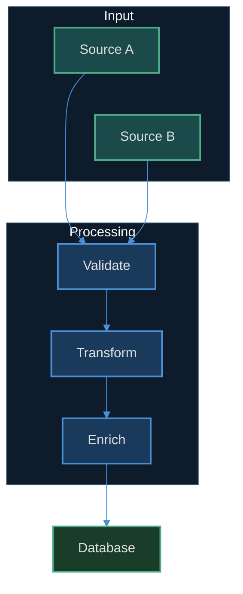

# Mermaid Conventions

## Decide whether to theme at all

**Default: do not hardcode a theme.** Markdown renderers — GitHub, Obsidian,
VS Code — follow the reader's light/dark preference. A diagram with
`fill:#1a3a5c` baked in is unreadable for anyone on a light theme, including
you, in GitHub's default view.

Apply the dark theme below **only** when the rendering context is known to be
dark and fixed:

- An asset exported to PNG/SVG for a dark slide deck or dark site.
- A document in a repo whose renderer is pinned to a dark theme.

For everything else, write plain Mermaid and let the renderer decide. If you
need semantic grouping without hardcoded colour, use `classDef` with
`stroke-dasharray` or distinct node shapes instead of fills.

## Semantic palette

When theming is warranted, use these classes by meaning, never by position.

| Class | Fill | Stroke | Meaning |
|-------|------|--------|---------|
| `input` | `#1a4a4a` | `#4ead8a` | Input data, source files, external systems |
| `primary` | `#1a3a5c` | `#4a90d9` | Core processing, main components |
| `ai` | `#2d1f4e` | `#9d6dd9` | AI/ML processing, API calls |
| `browser` | `#3d2d1a` | `#d4944a` | Browser automation, external services |
| `output` | `#1a3d2a` | `#4ead8a` | Output data, results, metadata |
| `danger` | `#4a1a1a` | `#d94a4a` | Errors, failures, destructive actions |
| `neutral` | `#2a2a3a` | `#6b7280` | Utility, secondary, informational |

Text is `#e0e0e0`; stroke width is `2px`. Hex only — never colour names.

```
classDef input fill:#1a4a4a,stroke:#4ead8a,stroke-width:2px,color:#e0e0e0
classDef primary fill:#1a3a5c,stroke:#4a90d9,stroke-width:2px,color:#e0e0e0
classDef ai fill:#2d1f4e,stroke:#9d6dd9,stroke-width:2px,color:#e0e0e0
classDef browser fill:#3d2d1a,stroke:#d4944a,stroke-width:2px,color:#e0e0e0
classDef output fill:#1a3d2a,stroke:#4ead8a,stroke-width:2px,color:#e0e0e0
classDef danger fill:#4a1a1a,stroke:#d94a4a,stroke-width:2px,color:#e0e0e0
classDef neutral fill:#2a2a3a,stroke:#6b7280,stroke-width:2px,color:#e0e0e0
```

## Dark theme init block

One block covers flowcharts, class, state, ER, pie, mindmap and gitgraph.
Sequence diagrams and Gantt charts need extra variables.

**General:**

```
%%{init: {'theme': 'dark', 'themeVariables': {
  'primaryColor': '#1a3a5c',
  'primaryTextColor': '#e0e0e0',
  'primaryBorderColor': '#4a90d9',
  'lineColor': '#4a90d9',
  'clusterBkg': '#0d1b2a',
  'clusterBorder': '#2a4a6b',
  'edgeLabelBackground': '#1a1a2e'
}}}%%
```

**Sequence diagrams** — add:

```
  'actorBkg': '#1a3a5c', 'actorBorder': '#4a90d9', 'actorTextColor': '#e0e0e0',
  'signalColor': '#4a90d9', 'signalTextColor': '#e0e0e0',
  'labelBoxBkgColor': '#0d1b2a', 'labelBoxBorderColor': '#2a4a6b',
  'labelTextColor': '#e0e0e0', 'loopTextColor': '#e0e0e0',
  'noteBkgColor': '#2d1f4e', 'noteBorderColor': '#9d6dd9', 'noteTextColor': '#e0e0e0',
  'activationBkgColor': '#1a3a5c', 'activationBorderColor': '#4a90d9'
```

**Gantt charts** — add:

```
  'textColor': '#e0e0e0', 'sectionBkgColor': '#0d1b2a',
  'altSectionBkgColor': '#1a1a2e', 'gridColor': '#2a4a6b',
  'todayLineColor': '#4ead8a'
```

## Layout rules

1. `TD` for pipelines — vertical flow reads naturally.
2. `LR` for data flow — horizontal matches reading direction.
3. `direction LR` inside a subgraph lays siblings out horizontally within a
   vertical flow.
4. `~~~` invisible links control horizontal spacing of siblings.
5. Keep node labels short; use `\n` rather than long single lines.
6. Use subgraphs for visual hierarchy, with `#0d1b2a` backgrounds and `#2a4a6b`
   borders when themed.

## Example



## Related

Markdown file structure, backlinks and the Related/Tags footer live in the
sibling `markdown-conventions` skill in this plugin.
