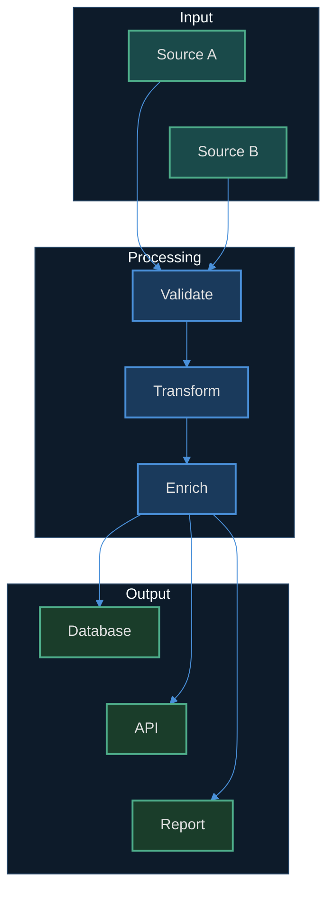
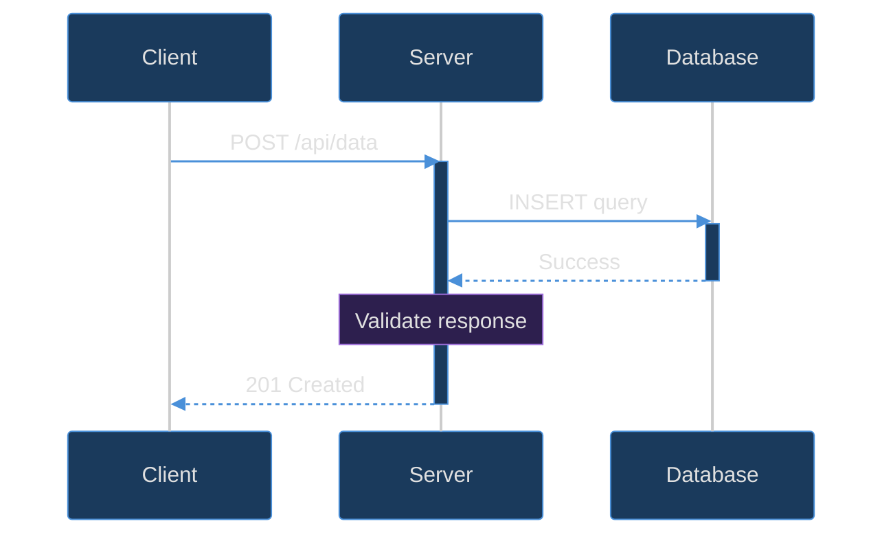

# Professional Mermaid Diagram Generator

Generate beautiful, dark-mode Mermaid diagrams that render professionally in VS Code, Obsidian, and other local markdown editors.

## Arguments

- `$0` — Diagram type: `flowchart`, `sequence`, `class`, `state`, `er`, `gantt`, `pie`, `mindmap`, or `gitgraph`
- `$1+` — Description of what to diagram

If no arguments provided, ask the user what they want to diagram.

## Theme Configuration

ALWAYS include this dark theme init block at the top of every Mermaid diagram. Choose the appropriate variant based on diagram type:

### Flowcharts (flowchart TD/LR/RL/BT)

```
%%{init: {'theme': 'dark', 'themeVariables': {
  'primaryColor': '#1a3a5c',
  'primaryTextColor': '#e0e0e0',
  'primaryBorderColor': '#4a90d9',
  'lineColor': '#4a90d9',
  'clusterBkg': '#0d1b2a',
  'clusterBorder': '#2a4a6b',
  'edgeLabelBackground': '#1a1a2e'
}}}%%
```

### Sequence Diagrams

```
%%{init: {'theme': 'dark', 'themeVariables': {
  'primaryColor': '#1a3a5c',
  'primaryTextColor': '#e0e0e0',
  'primaryBorderColor': '#4a90d9',
  'lineColor': '#4a90d9',
  'actorBkg': '#1a3a5c',
  'actorBorder': '#4a90d9',
  'actorTextColor': '#e0e0e0',
  'signalColor': '#4a90d9',
  'signalTextColor': '#e0e0e0',
  'labelBoxBkgColor': '#0d1b2a',
  'labelBoxBorderColor': '#2a4a6b',
  'labelTextColor': '#e0e0e0',
  'loopTextColor': '#e0e0e0',
  'noteBkgColor': '#2d1f4e',
  'noteBorderColor': '#9d6dd9',
  'noteTextColor': '#e0e0e0',
  'activationBkgColor': '#1a3a5c',
  'activationBorderColor': '#4a90d9'
}}}%%
```

### Class Diagrams, State Diagrams, ER Diagrams

```
%%{init: {'theme': 'dark', 'themeVariables': {
  'primaryColor': '#1a3a5c',
  'primaryTextColor': '#e0e0e0',
  'primaryBorderColor': '#4a90d9',
  'lineColor': '#4a90d9'
}}}%%
```

### Gantt Charts

```
%%{init: {'theme': 'dark', 'themeVariables': {
  'primaryColor': '#4a90d9',
  'primaryTextColor': '#e0e0e0',
  'primaryBorderColor': '#4a90d9',
  'lineColor': '#4a90d9',
  'textColor': '#e0e0e0',
  'sectionBkgColor': '#0d1b2a',
  'altSectionBkgColor': '#1a1a2e',
  'gridColor': '#2a4a6b',
  'todayLineColor': '#4ead8a'
}}}%%
```

### Pie Charts, Mindmaps, Git Graphs

```
%%{init: {'theme': 'dark', 'themeVariables': {
  'primaryColor': '#4a90d9',
  'primaryTextColor': '#e0e0e0',
  'primaryBorderColor': '#4a90d9',
  'lineColor': '#4a90d9'
}}}%%
```

## Color Palette

Use these `classDef` definitions to colour-code nodes by semantic meaning. Apply with `class NodeName className` or `NodeName:::className`.

| Class | Fill | Stroke | Semantic Use |
|-------|------|--------|-------------|
| `input` | `#1a4a4a` | `#4ead8a` | Input data, source files, external systems |
| `primary` | `#1a3a5c` | `#4a90d9` | Core processing, main components |
| `ai` | `#2d1f4e` | `#9d6dd9` | AI/ML processing, API calls |
| `browser` | `#3d2d1a` | `#d4944a` | Browser automation, external services |
| `output` | `#1a3d2a` | `#4ead8a` | Output data, results, metadata |
| `danger` | `#4a1a1a` | `#d94a4a` | Errors, failures, destructive actions |
| `neutral` | `#2a2a3a` | `#6b7280` | Utility, secondary, informational |

All text colour is `#e0e0e0` and stroke-width is `2px`.

### classDef Syntax

```
classDef input fill:#1a4a4a,stroke:#4ead8a,stroke-width:2px,color:#e0e0e0
classDef primary fill:#1a3a5c,stroke:#4a90d9,stroke-width:2px,color:#e0e0e0
classDef ai fill:#2d1f4e,stroke:#9d6dd9,stroke-width:2px,color:#e0e0e0
classDef browser fill:#3d2d1a,stroke:#d4944a,stroke-width:2px,color:#e0e0e0
classDef output fill:#1a3d2a,stroke:#4ead8a,stroke-width:2px,color:#e0e0e0
classDef danger fill:#4a1a1a,stroke:#d94a4a,stroke-width:2px,color:#e0e0e0
classDef neutral fill:#2a2a3a,stroke:#6b7280,stroke-width:2px,color:#e0e0e0
```

## Design Rules

1. **Always include the theme init block** — never generate an unstyled diagram
2. **Use `classDef` for semantic colouring** — group nodes by function, not position
3. **Prefer `TD` (top-down) for pipelines** — vertical flow reads naturally
4. **Prefer `LR` (left-right) for data flow** — horizontal matches reading direction
5. **Use `direction LR` inside subgraphs** to lay out sibling nodes horizontally within a vertical flow
6. **Use `~~~` invisible links** to control horizontal spacing of sibling nodes within subgraphs
7. **Keep node labels short** — use `\n` for multi-line labels rather than long single lines
8. **Use subgraphs** to group related nodes and provide visual hierarchy
9. **Hex colours only** — never use colour names (`blue`, `red`), always hex (`#4a90d9`)
10. **Subgraph backgrounds** should use deep navy (`#0d1b2a`) with subtle borders (`#2a4a6b`)

## Example: Complete Flowchart

````markdown

````

## Example: Sequence Diagram

````markdown

````

## Workflow

1. Read the user's request (or `$ARGUMENTS`)
2. Determine the best diagram type for the content
3. Generate the Mermaid diagram with the appropriate theme init block
4. Apply semantic `classDef` colour coding
5. Write the diagram into the target file, or present it in a code block if no file specified
6. If editing an existing file, find the right location to insert the diagram
